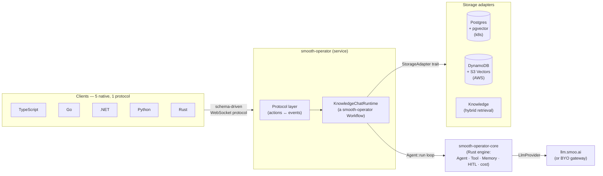
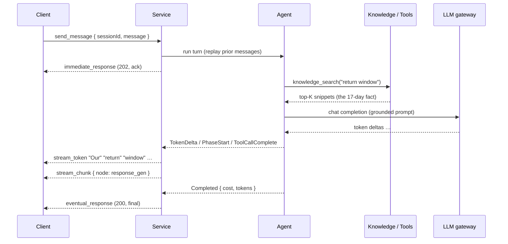
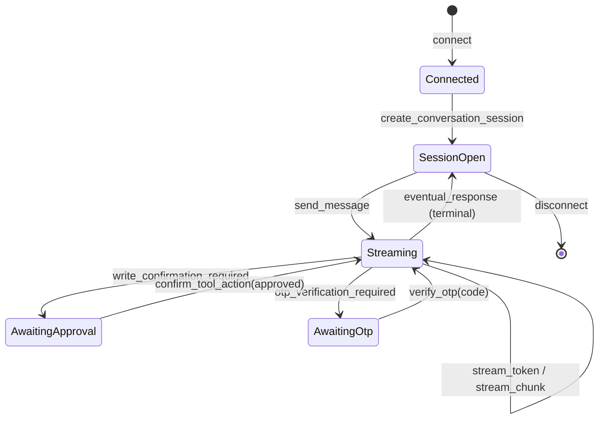
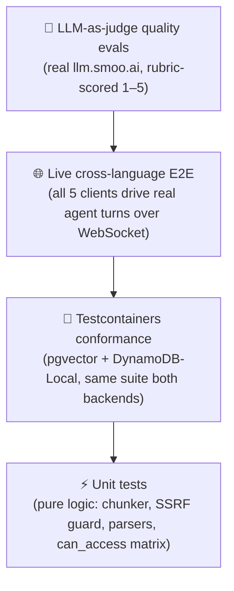
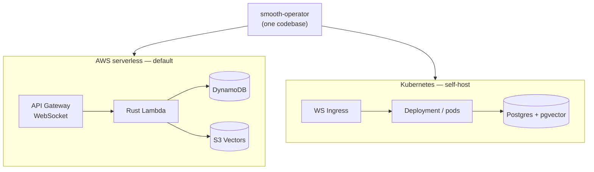

<p align="center"></p>

<p align="center"><strong>An open-source, serverless-native, polyglot AI agent service</strong> — knowledge chat, tools, and multi-participant conversations over one schema-driven WebSocket protocol.</p>

<p align="center">
  <a href="./LICENSE"></a>
  
  
  <a href="https://lom.smoo.ai"></a>
</p>

---

## What is this?

**smooth-operator** is an [Onyx](https://github.com/onyx-dot-app/onyx)-class knowledge-assistant platform that runs on **AWS Lambda** — no Vespa, no Celery worker fleet, no monolith to babysit. The agent orchestration engine is Rust ([`smooth-operator-core`](https://github.com/SmooAI/smooth-operator-core)); the **service** speaks one schema-driven WebSocket protocol that **five languages** — TypeScript, Go, C#/.NET, Python, and Rust — implement natively.

You get hybrid retrieval (dense + sparse + rerank), durable agent checkpoints, human-in-the-loop approvals, and multi-participant conversations (`user` · `ai-agent` · `human-agent`) — deployed with **one command** to AWS serverless *or* Kubernetes.

> **Built in the open, test-first.** See [`docs/ROADMAP.md`](docs/ROADMAP.md) for what works today (a lot — dual deploy, all five clients, live cross-language E2E, ingestion, ACLs, rerank, OTel) and what's queued.

---

## 30-second quickstart

Run the reference Rust service locally and drive a real agent turn. The server talks to the SmooAI LLM gateway (`llm.smoo.ai`) — bring a gateway key.

```bash
git clone https://github.com/SmooAI/smooth-operator && cd smooth-operator/rust

# Point at the gateway and seed two demo knowledge docs.
export SMOOAI_GATEWAY_KEY=sk-…           # your llm.smoo.ai key
export SMOOTH_AGENT_SEED_KB=1            # seeds a distinctive "17-day return window" doc

cargo run -p smooai-smooth-operator-server
# → smooth-operator-server listening on ws://127.0.0.1:8787/ws (model claude-haiku-4-5)
```

That's it — an agent backend on `ws://127.0.0.1:8787/ws`, with knowledge retrieval, tool-calling, and streaming. No database to provision (the reference server uses the in-memory adapter); swap in Postgres or DynamoDB when you deploy.

> No key? The server still boots and answers protocol actions — only `send_message` (which needs the LLM) errors cleanly until `SMOOAI_GATEWAY_KEY` is set.

---

## Run locally in 5 minutes

The 30-second quickstart above glosses one thing a fresh clone has to know: **the
Rust service builds against the engine crate via a sibling path dependency.**
`rust/Cargo.toml` points at `../../smooth-operator-core/rust/smooth-operator-core`,
so you must check out [`smooth-operator-core`](https://github.com/SmooAI/smooth-operator-core)
**next to** this repo:

```text
~/dev/
├── smooth-operator/          # this repo
└── smooth-operator-core/     # the engine — clone it as a sibling, NOT a child
```

```bash
# 1. Clone both repos side by side.
git clone https://github.com/SmooAI/smooth-operator-core
git clone https://github.com/SmooAI/smooth-operator
cd smooth-operator/rust

# 2. Local-only auth + a gateway key.
export AUTH_MODE=none                     # dev only — boots /ws with the admin API open
export SMOOAI_GATEWAY_KEY=sk-…            # your llm.smoo.ai key (talks to the real gateway)
export SMOOTH_AGENT_SEED_KB=1             # seed a demo "17-day return window" doc

# 3. Run the reference server.
cargo run -p smooai-smooth-operator-server
# → smooth-operator-server listening on ws://127.0.0.1:8787/ws (model claude-haiku-4-5)
```

Connect any client to **`ws://127.0.0.1:8787/ws`** (note the `/ws` path — the server
routes the WebSocket there) and drive a turn with the [TypeScript](typescript/README.md),
[Go](go/README.md), [.NET](dotnet/README.md), [Python](python/README.md), or
[Rust](rust/README.md) client.

**Want the full ingest → chat path?** The [`rust/examples/dev-support`](rust/examples/dev-support)
example is the showcase: point it at a GitHub repo, run `dev-support ingest`, then
`dev-support chat` to ask grounded questions about that codebase. It needs a
`GITHUB_TOKEN` (read scope) in addition to the gateway key — see its
[README](rust/examples/dev-support/README.md).

> **Where do the keys come from?** `SMOOAI_GATEWAY_KEY` is a `llm.smoo.ai` gateway
> key (hosted users get one from [lom.smoo.ai](https://lom.smoo.ai); self-hosters
> point `SMOOAI_GATEWAY_URL` at any OpenAI-compatible endpoint and use that
> provider's key). `AUTH_MODE=none` is **dev-only** — it leaves `/admin` open; set
> `AUTH_MODE=jwt` (or `smoo`) with the `AUTH_JWT_*` vars before exposing the server.

---

## Watch it stream

Connect, start a session, send a turn, and watch tokens stream in — then `await` the authoritative terminal response. Here in TypeScript ([`@smooai/smooth-operator`](typescript/README.md)); the same shape exists in [Go](go/README.md), [.NET](dotnet/README.md), [Python](python/README.md), and [Rust](rust/README.md).

```ts
import { SmoothAgentClient } from '@smooai/smooth-operator';

const client = new SmoothAgentClient({ url: 'ws://127.0.0.1:8787/ws' });
await client.connect();

const session = await client.createConversationSession({ agentId, userName: 'Alice' });

// One turn. Iterate the stream; `await` the same handle for the final state.
const turn = client.sendMessage({ sessionId: session.sessionId, message: 'How long is your return window?' });

for await (const ev of turn) {
  if (ev.type === 'stream_chunk') console.error(`  ↳ node: ${ev.node}`); // knowledge_search, response_gen, …
  if (ev.type === 'stream_token') process.stdout.write(ev.token ?? '');  // "Our return window is 17 days…"
  if (ev.type === 'write_confirmation_required') {
    // HITL: a tool wants to write — approve, and the resumed stream flows back into this same turn.
    client.confirmToolAction({ sessionId: session.sessionId, requestId: turn.requestId, approved: true });
  }
}

const final = await turn; // EventualResponse — cost, tokens, messageId
```

The model autonomously calls `knowledge_search`, retrieves the seeded **17-day** return window, and grounds its answer in it — verified live against `llm.smoo.ai` in [`rust/smooth-operator/tests/e2e_llm_smoo_ai.rs`](rust/smooth-operator) and across all five clients.

---

## Why this (and not Onyx)?

Onyx/Danswer are wonderful — but **stateful and container-bound**: Postgres + a dedicated vector engine (Vespa) + Redis + a blob store + long-running Celery workers. That's a poor fit for stateless serverless and an awkward thing to "just deploy."

smooth-operator makes a different bet:

|                       | Onyx                                   | **smooth-operator**                                              |
| --------------------- | -------------------------------------- | --------------------------------------------------------------- |
| Compute               | Long-running containers + Celery       | **AWS Lambda** (or k8s pods — your choice)                       |
| Vector store          | **Vespa** (a cluster to run)           | **S3 Vectors** (AWS) / **pgvector** (k8s) — no cluster on AWS    |
| Queue / workers       | Redis + Celery worker fleet            | Event-driven Lambda / Step Functions (AWS) or Jobs (k8s)        |
| Languages             | Python monolith                        | **One protocol, 5 native clients** (TS · Go · .NET · Python · Rust) |
| Agent core            | In-process Python                      | Rust engine ([`smooth-operator-core`](https://github.com/SmooAI/smooth-operator-core)) behind a stable wire protocol |
| Deploy                | docker-compose / Helm                  | **`SST` (one command)** *or* Helm + ArgoCD                       |

What we **kept** from Onyx: hybrid (vector + keyword) retrieval with reranking, the clean Chat · RAG · Agents · Actions decomposition, connector-style ingestion, and the MIT, batteries-included self-host story. What we **dropped**: Vespa, persistent Redis/MinIO, and the standing worker fleet — see [`docs/ARCHITECTURE.md`](docs/ARCHITECTURE.md) §5.

---

## Architecture

One protocol in front; a swappable engine and storage behind it. A client never names a language, a backend, or whether the engine is embedded or remote — it only ever sees the protocol.



### An agent turn, end to end



### Protocol lifecycle (incl. HITL)



Full action/event tables, the `AgentEvent` mapping, and connection-state keys are in [`docs/PROTOCOL.md`](docs/PROTOCOL.md).

---

## Test-driven by default

> **Nothing here is vibe-coded — it's verified against a real LLM gateway.** Substring tests prove a reply *contains* the right number; an LLM-as-judge proves the agent *reasoned* its way there and didn't hallucinate. We run both.



### The numbers

| Layer                          | Tests   |
| ------------------------------ | ------- |
| Engine (`smooth-operator-core`) | **408** |
| Service — Rust                 | **126** |
| Client — TypeScript            | **16**  |
| Client — Go                    | **26**  |
| Client — .NET                  | **27**  |
| Client — Python                | **26**  |

### The proof story

The headline isn't the count — it's a **real defect a substring test would have missed**. On the first live run, our LLM-as-judge scored a multi-turn answer **1/5**: the runtime built a fresh agent per turn, so turn 2 had no memory of turn 1's delivery date and couldn't compute the last return day. A `contains("the 22nd")` assertion would have stayed green on a hallucinated guess. The judge caught it; the fix wired per-session memory; **it now scores 5/5**.

That's the whole bet: quality regressions that only a grader can see, caught in CI. Details — the five scenarios, the rubric, the same-model-judge knob — in [`docs/EVALS.md`](docs/EVALS.md).

### Gated, never silently skipped

Live tests need a gateway key. They are **gated, not deleted**: with `SMOOTH_AGENT_E2E=1` + `SMOOAI_GATEWAY_KEY` they run (and print every per-scenario score under `--nocapture`); without them they print an explicit **skip** and return — so credential-free `cargo test` and CI stay green, and the nightly job runs the full live suite. The gateway key is read from the environment and **never printed**.

```bash
# Unit + conformance — no creds, runs everywhere
cd rust && cargo test

# + live LLM-as-judge evals
export SMOOAI_GATEWAY_KEY=sk-… SMOOTH_AGENT_E2E=1
cargo test -p smooai-smooth-operator-evals --test llm_judge -- --nocapture --test-threads=1
```

---

## Deploy

Two first-class paths from one codebase. The `StorageAdapter` seam is what makes the same agent code run on either — application code never names a backend.



```bash
# AWS serverless (SST) — API GW WebSocket + Rust Lambda + DynamoDB + S3 Vectors
cd deploy/sst && pnpm install && npx sst deploy --stage prod

# Kubernetes (Helm + ArgoCD) — service + WS ingress, external pgvector Postgres
helm install smooth-operator deploy/k8s --set image.tag=$(git rev-parse --short HEAD)
```

Both paths are CI-verified (SST: synth + 47 workspace tests + `tsc`; k8s: `helm lint`/`template` + `kubectl` dry-run). Full matrix and the shared [`SmooAI/deploy`](https://github.com/SmooAI/deploy) package in [`docs/DEPLOY.md`](docs/DEPLOY.md).

---

## Smoo-powered or bring-your-own

A recurring principle across the whole stack: **same code, two postures.**

| Capability      | Smoo-powered (hosted)             | Bring-your-own (self-host)               |
| --------------- | --------------------------------- | ---------------------------------------- |
| LLM gateway     | `llm.smoo.ai`                     | any OpenAI-compatible endpoint           |
| Embeddings      | gateway (`text-embedding-3-small`) | `DeterministicEmbedder` or your provider |
| Web search      | Smoo provider                     | Brave / Bing / Tavily via `WebSearchProvider` |
| Identity / RBAC | Smoo identity                     | SST OpenAuth (OIDC/OAuth/SAML)           |
| Connectors      | managed GitHub/Slack apps         | your tokens, same `Connector` trait      |

Self-host brings their own; hosted wires Smoo's apps. The seams are identical — see [`docs/INGESTION.md`](docs/INGESTION.md), [`docs/TOOLS.md`](docs/TOOLS.md), and [`docs/STORAGE.md`](docs/STORAGE.md).

---

## The two-repo split

| Repo | What it is |
| ---- | ---------- |
| [`smooth-operator-core`](https://github.com/SmooAI/smooth-operator-core) | The **agent engine** — `Agent`, `Workflow`, `Tool`, `CheckpointStore`, `LlmProvider`, `Memory`, `KnowledgeBase`. Crate `smooai-smooth-operator-core`. **408 tests.** |
| **`smooth-operator`** (this repo) | The **service** — conversations, knowledge ingestion + retrieval, the tool catalog, the WebSocket protocol, the five clients, and the AWS/k8s deploy paths. |

## Repository layout

```
smooth-operator/
├── spec/         # The language-neutral wire protocol (JSON Schema) — source of truth for all clients
├── rust/         # Reference service (flagship crate smooai-smooth-operator) + adapters, server, lambda, evals, ingestion
├── typescript/   # @smooai/smooth-operator — Lambda-native client (the smooai monorepo dogfoods this)
├── go/           # github.com/SmooAI/smooth-operator/go — protocol.Client
├── dotnet/       # SmooAI.SmoothOperator — client + the Microsoft.Extensions.AI IChatClient facade
├── python/       # smooth-operator (import smooth_operator) — async client
├── adapters/     # Storage adapters: postgres (pgvector) and dynamodb (S3 Vectors)
├── deploy/
│   ├── sst/      # AWS serverless (API GW WebSocket + Lambda + DynamoDB + S3 Vectors)
│   └── k8s/      # Helm chart + ArgoCD (Postgres + pgvector)
└── docs/         # Architecture, protocol, storage, evals, ingestion, access-control, observability, deploy, roadmap
```

## Run it hosted

Don't want to operate it yourself? **[lom.smoo.ai](https://lom.smoo.ai)** runs smooth-operator as a managed, multi-tenant service.

## Documentation

| Doc | What |
| --- | --- |
| [`docs/ARCHITECTURE.md`](docs/ARCHITECTURE.md) | System design, the agent pipeline, how it consumes the engine |
| [`docs/PROTOCOL.md`](docs/PROTOCOL.md) | The schema-driven WebSocket protocol |
| [`docs/STORAGE.md`](docs/STORAGE.md) | The `StorageAdapter` trait; Postgres and DynamoDB/S3 Vectors designs |
| [`docs/EVALS.md`](docs/EVALS.md) | The LLM-as-judge quality harness (the 1/5 → 5/5 story) |
| [`docs/INGESTION.md`](docs/INGESTION.md) | Connectors, chunking, the embedder seam |
| [`docs/TOOLS.md`](docs/TOOLS.md) | The built-in tool catalog + authoring your own |
| [`docs/ACCESS-CONTROL.md`](docs/ACCESS-CONTROL.md) | Document-level ACLs over org isolation |
| [`docs/OBSERVABILITY.md`](docs/OBSERVABILITY.md) | OpenTelemetry `gen_ai.*` tracing |
| [`docs/DEPLOY.md`](docs/DEPLOY.md) | Dual SST / k8s deploy + the shared `SmooAI/deploy` package |
| [`docs/ROADMAP.md`](docs/ROADMAP.md) | Phased build plan + current status |

## License

MIT © 2026 Smoo AI
