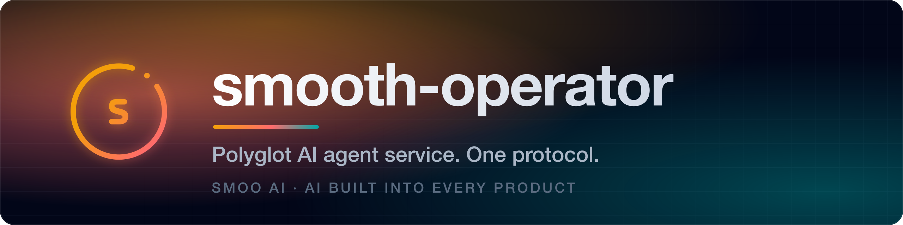
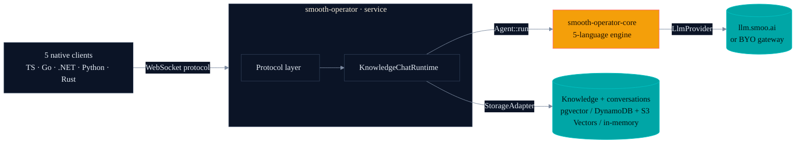
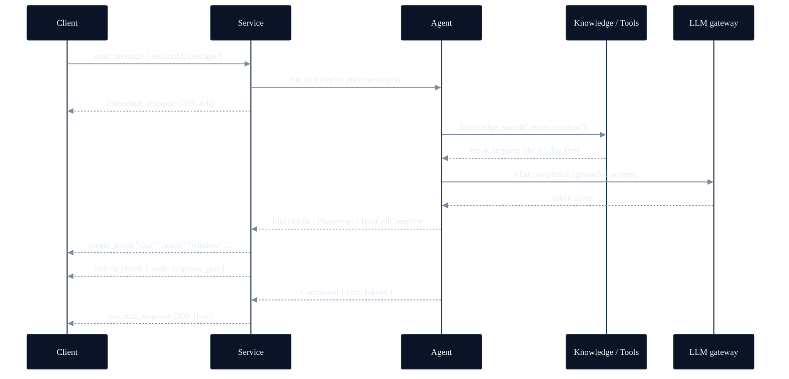
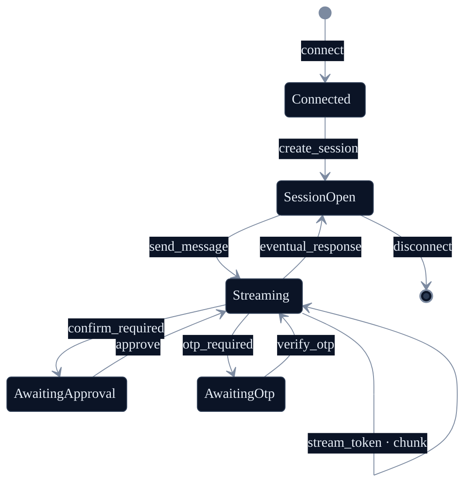
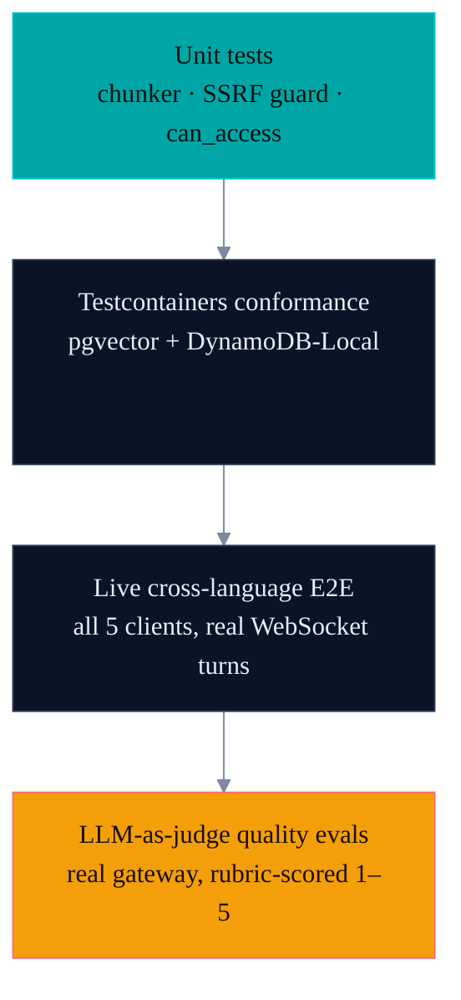

<p align="center">
  <a href="https://smoo.ai"></a>
</p>

<p align="center">
  <a href="https://smoo.ai"></a>
  <a href="./LICENSE"></a>
  <a href="https://lom.smoo.ai"></a>
</p>

<p align="center">
  
  
  
</p>

<p align="center">
  <a href="#what-is-this"><b>What it is</b></a> &nbsp;·&nbsp; <a href="#30-second-quickstart"><b>Quickstart</b></a> &nbsp;·&nbsp; <a href="#deployment-flavors"><b>Deploy flavors</b></a> &nbsp;·&nbsp; <a href="#architecture"><b>Architecture</b></a> &nbsp;·&nbsp; <a href="#-part-of-smoo-ai"><b>Platform</b></a>
</p>

---

> **A chat loop is a weekend project. A production agent _server_ is not.** Persistent sessions, a wire protocol your clients can actually speak, streaming turns, tools with hard limits on what they may never do, retrieval that respects who's asking. **smooth-operator is that server** — one operator binary that runs the same way on **Kubernetes**, **AWS serverless**, or a **single laptop process**, speaking one protocol to native clients in **five languages**. Built in the open, test-first.

---

## What is this?

**smooth-operator** is a **polyglot AI agent service**. The agent orchestration is done by [`smooth-operator-core`](https://github.com/SmooAI/smooth-operator-core) — a 5-language parity engine; the **service** wraps it with conversations, knowledge ingestion + retrieval, a tool catalog, and **one schema-driven WebSocket protocol** that clients in five languages speak natively.

You get hybrid retrieval (dense + sparse + rerank), durable agent checkpoints, human-in-the-loop approvals, and multi-participant conversations (`user` · `ai-agent` · `human-agent`) — behind a stable wire protocol, with **storage, backplane, and auth selected by config**, not by a code fork.

One operator binary, **three deployment flavors** (see [below](#deployment-flavors)):

- **Kubernetes** — the primary self-host target: a long-running service with Postgres + pgvector and a Redis/NATS backplane for multi-replica scale-out.
- **AWS serverless** — API Gateway WebSocket + Lambda + DynamoDB + S3 Vectors, deployed with SST.
- **Local** — a single in-memory process with auth off and zero external services, for laptop dev or to embed in-process.

The same binary picks its flavor from the environment (`SMOOTH_AGENT_STORAGE` · `SMOOTH_AGENT_BACKPLANE` · `AUTH_MODE`). No build flags, no second codebase.

> **Built in the open, test-first.** See [`docs/Planning/Roadmap.md`](docs/Planning/Roadmap.md) for what works today and what's queued.

---

## 30-second quickstart

Run the reference server **locally** — fully in-memory, no database, no auth, no AWS — and drive a real agent turn. The server talks to the SmooAI LLM gateway (`llm.smoo.ai`); bring a gateway key.

```bash
git clone https://github.com/SmooAI/smooth-operator && cd smooth-operator/rust

# Point at the gateway and seed a distinctive "17-day return window" demo doc.
export SMOOAI_GATEWAY_KEY=sk-…           # your llm.smoo.ai key
export SMOOTH_AGENT_SEED_KB=1            # seeds the demo knowledge docs

cargo run -p smooai-smooth-operator-server
# → smooth-operator-server (local flavor) listening on ws://127.0.0.1:8787/ws (model claude-haiku-4-5)
```

That's it — an agent backend on `ws://127.0.0.1:8787/ws`, with knowledge retrieval, tool-calling, and streaming. With no env set, the binary boots the **local flavor**: in-memory storage, in-memory backplane, loopback bind, admin off. Set `SMOOTH_AGENT_STORAGE=postgres` (or `dynamodb`) and a backplane to graduate the *same* binary to the k8s or serverless flavor.

> No key? The server still boots and answers protocol actions — only `send_message` (which needs the LLM) errors cleanly until `SMOOAI_GATEWAY_KEY` is set.

You can also embed the local flavor **in-process** from Rust — `smooth_operator_server::local::serve_local("127.0.0.1:8787")`, or `LocalServer::builder().seed_kb(true).spawn()` for a handle with a graceful-shutdown switch. See [`deploy/local/README.md`](deploy/local/README.md).

---

## Watch it stream

Connect, start a session, send a turn, and watch tokens stream in — then `await` the authoritative terminal response. Here in TypeScript ([`@smooai/smooth-operator`](typescript/README.md)); the same shape exists in [Go](go/README.md), [.NET](dotnet/README.md), [Python](python/README.md), and [Rust](rust/README.md).

```ts
import { SmoothAgentClient } from '@smooai/smooth-operator';

const client = new SmoothAgentClient({ url: 'ws://127.0.0.1:8787/ws' });
await client.connect();

const session = await client.createConversationSession({ agentId, userName: 'Alice' });

// One turn. Iterate the stream; `await` the same handle for the final state.
const turn = client.sendMessage({ sessionId: session.sessionId, message: 'How long is your return window?' });

for await (const ev of turn) {
  if (ev.type === 'stream_chunk') console.error(`  ↳ node: ${ev.node}`); // knowledge_search, response_gen, …
  if (ev.type === 'stream_token') process.stdout.write(ev.token ?? '');  // "Our return window is 17 days…"
  if (ev.type === 'write_confirmation_required') {
    // HITL: a tool wants to write — approve, and the resumed stream flows back into this same turn.
    client.confirmToolAction({ sessionId: session.sessionId, requestId: turn.requestId, approved: true });
  }
}

const final = await turn; // EventualResponse — cost, tokens, messageId
```

The model autonomously calls `knowledge_search`, retrieves the seeded **17-day** return window, and grounds its answer in it — verified live against `llm.smoo.ai` and across every client.

> Need an embeddable web UI? The TypeScript side ships a [React binding](typescript/src/react) and an [embeddable widget](typescript/src/widget) (a custom element) on top of the same client.

---

## Deployment flavors

One operator binary, one codebase. The `StorageAdapter` + backplane + auth seams are what let the same agent code run on any of three flavors — application code never names a backend. The flavor is selected by config, not by a build.

| | **Kubernetes** (primary self-host) | **AWS serverless** (SST) | **Local** (dev / embed) |
| --- | --- | --- | --- |
| Compute | Long-running pods | API GW WebSocket → Lambda | One in-process server |
| Storage | Postgres + pgvector | DynamoDB + S3 Vectors | In-memory |
| Backplane | Redis / NATS (multi-replica) | API GW connections | In-memory (single process) |
| Auth | `AUTH_MODE=jwt` / `smoo` | `AUTH_MODE=jwt` / `smoo` | `AUTH_MODE=none` (dev only) |
| `SMOOTH_AGENT_STORAGE` | `postgres` | `dynamodb` | `memory` (default) |
| Deploy | `helm install smooth-operator ./deploy/k8s` | `npx sst deploy` in `deploy/sst` | `cargo run -p smooai-smooth-operator-server` |

```bash
# Kubernetes (Helm + ArgoCD) — service + WS ingress, Postgres + pgvector, Redis/NATS backplane
helm install smooth-operator ./deploy/k8s --set image.tag=$(git rev-parse --short HEAD)

# AWS serverless (SST) — API GW WebSocket + Lambda + DynamoDB + S3 Vectors
cd deploy/sst && pnpm install && npx sst deploy --stage prod

# Local — fully in-memory, auth off, no external services
cargo run -p smooai-smooth-operator-server
```

What every flavor **keeps**: hybrid (vector + keyword) retrieval with reranking, a clean Chat · RAG · Agents · Actions decomposition, connector-style ingestion, document-level ACLs over org isolation, and the MIT, batteries-included self-host story. See [`deploy/README.md`](deploy/README.md) and [`docs/DEPLOY.md`](docs/DEPLOY.md) for the full matrix.

---

## Architecture

One protocol in front; a swappable engine and storage behind it. A client never names a language, a backend, or whether the engine is embedded or remote — it only ever sees the protocol.



### An agent turn, end to end



### Protocol lifecycle (incl. HITL)



Full action/event tables, the `AgentEvent` mapping, and connection-state keys are in [`docs/PROTOCOL.md`](docs/PROTOCOL.md).

---

## Extensible — and safe by construction

An agent is only useful when it can *do* things, and only trustworthy when you can say what it may never do. The server gives you both seams — and they're the emotional core of the whole design.

**Give it your tools.** Install a tool provider (the `ToolProvider` seam in Rust, `tools` in the TS/Python/Go/.NET servers) and the runner merges your tools with the built-ins for every turn — scoped to the turn's org and the caller's entitlements, so a per-org CRM lookup or a ticketing action drops in without the shared core ever learning your schema.

**Let it gain tools with no redeploy.** The server hosts **SEP extensions** — out-of-process tool providers discovered at runtime and attached to the turn, their `ui/confirm` prompts bridged straight into the protocol's confirmation frames for human-in-the-loop. It's gated: an extension contributes tools **only** if you name it in `SMOOTH_EXTENSIONS_ALLOW`. Nothing loads by default.

**Then declare the lines it can't cross.** Every tool — built-in, host-provided, or from an extension — flows through the same gates, so the guardrails hold no matter where a tool came from:

- **Per-agent allow-list** — an agent's `tool_config.enabledTools` restricts its turn to exactly those tools. Off the list, off the table.
- **The auth-level `ToolHook`** — a tool tagged `admin` or `end_user` is *blocked at call time* on a public agent unless the caller is verified (the session's OTP bit, or your `SessionAuthenticator` seam). The hook runs before the tool does, and **fails closed**.
- **Document-level ACLs** — both retrieval paths read through the storage adapter's access-scoped view, so a document the requester isn't entitled to is dropped before it can reach the model or land in a citation.

That's what "point it at prod" costs here: not a leap of faith, a declaration. You decide what the agent can touch; the runner enforces it. See [`docs/TOOLS.md`](docs/TOOLS.md) and [`docs/ACCESS-CONTROL.md`](docs/ACCESS-CONTROL.md).

---

## Five languages, one protocol

The same server, the same wire protocol, in the language your stack already speaks. Every client connects to every server, unmodified — a *tested* guarantee, since all five servers run the shared [`spec/conformance/scenarios`](spec/conformance/scenarios) corpus.

| Language | Client package | Server package | Registry |
| --- | --- | --- | --- |
| **TypeScript** | `@smooai/smooth-operator` | `@smooai/smooth-operator-server` | [npm](https://www.npmjs.com/package/@smooai/smooth-operator) |
| **Python** | `smooai-smooth-operator` | `smooai-smooth-operator-server` | [PyPI](https://pypi.org/project/smooai-smooth-operator/) |
| **Rust** | `smooai-smooth-operator` | `smooai-smooth-operator-server` | [crates.io](https://crates.io/crates/smooai-smooth-operator-server) |
| **.NET** | `SmooAI.SmoothOperator` | `SmooAI.SmoothOperator.Server` | [NuGet](https://www.nuget.org/packages/SmooAI.SmoothOperator) |
| **Go** | `…/smooth-operator/go` | `…/smooth-operator/go/server` | [pkg.go.dev](https://pkg.go.dev/github.com/SmooAI/smooth-operator/go) |

The clients ship to their registries today; the Rust server crate is published to crates.io, and the other servers live in-repo (`typescript/server`, `python/server`, `go/server`, `dotnet/server`). The TS side also ships a **React binding** and an **embeddable web-component widget** as subpath exports of the same npm package.

---

## The polyglot story (honest status)

One protocol, defined once in [`spec/`](spec) (JSON Schema). Everything else is generated or hand-written to match it.

| Surface | Status |
| --- | --- |
| **Engine** ([`smooth-operator-core`](https://github.com/SmooAI/smooth-operator-core)) | **5-language parity engine** — Rust · C# · Python · TypeScript · Go, each published (crates.io / NuGet / PyPI / npm / Go module). Rust is the reference; the others mirror its surface. |
| **Protocol clients** | **All five languages** — TypeScript (`@smooai/smooth-operator`), Go, .NET (with a `Microsoft.Extensions.AI` `IChatClient` facade), Python, Rust. The TS side also ships a **React binding** and an **embeddable widget**. |
| **Servers** | **All five languages** — Rust · C# · Python · TypeScript · Go, each consuming its own language's engine so a host can run the full service in its native stack. Rust + C# carry the full surface (ingestion, admin, ACL, storage adapters); Python/TS/Go are native servers (transport · frame dispatch · per-turn engine · sessions · auth · graceful drain). **All five run the shared scenario conformance corpus** — protocol parity, tested. |

> All five native servers now exist and run the same [`spec/conformance/scenarios`](spec/conformance/scenarios) corpus — driven by the engine's deterministic mock, so they must produce identical protocol output (the corpus already caught and fixed real error-handling divergences in the TS and C# servers). The Rust + C# servers carry the full surface; the Python/TS/Go servers are native and at protocol parity, growing toward the full feature surface. The five clients, five engines, and five servers are all real.

---

## Test-driven by default

> **Nothing here is vibe-coded — it's verified against a real LLM gateway.** Substring tests prove a reply *contains* the right number; an LLM-as-judge proves the agent *reasoned* its way there and didn't hallucinate. We run both.



All five native servers run a **shared scenario conformance corpus** ([`spec/conformance/scenarios`](spec/conformance/scenarios)) — language-neutral protocol flows driven by the engine's deterministic mock, so every server must produce identical output. That's the polyglot parity oracle, on top of each server's own protocol/ingestion/ACL/rerank/embedder suites and the engine's offline suite ([337 tests](https://github.com/SmooAI/smooth-operator-core) on a deterministic `MockLlmClient`). The five protocol clients are exercised against a real WebSocket in a cross-language E2E harness.

### The proof story

The headline isn't a count — it's a **real defect a substring test would have missed**. On the first live run, our LLM-as-judge scored a multi-turn answer **1/5**: the runtime built a fresh agent per turn, so turn 2 had no memory of turn 1's delivery date and couldn't compute the last return day. A `contains("the 22nd")` assertion would have stayed green on a hallucinated guess. The judge caught it; the fix wired per-session memory; **it now scores 5/5**.

That's the whole bet: quality regressions that only a grader can see, caught in CI. Details — the five scenarios, the rubric, the same-model-judge knob — in [`docs/EVALS.md`](docs/EVALS.md).

### Gated, never silently skipped

Live tests need a gateway key. They are **gated, not deleted**: with `SMOOTH_AGENT_E2E=1` + `SMOOAI_GATEWAY_KEY` they run (and print every per-scenario score under `--nocapture`); without them they print an explicit **skip** and return — so credential-free `cargo test` and CI stay green, and the nightly job runs the full live suite. The gateway key is read from the environment and **never printed**.

```bash
# Unit + conformance — no creds, runs everywhere
cd rust && cargo test

# + live LLM-as-judge evals
export SMOOAI_GATEWAY_KEY=sk-… SMOOTH_AGENT_E2E=1
cargo test -p smooai-smooth-operator-evals --test llm_judge -- --nocapture --test-threads=1
```

---

## Smoo-powered or bring-your-own

A recurring principle across the whole stack: **same code, two postures.**

| Capability      | Smoo-powered (hosted)             | Bring-your-own (self-host)               |
| --------------- | --------------------------------- | ---------------------------------------- |
| LLM gateway     | `llm.smoo.ai`                     | any OpenAI-compatible endpoint           |
| Embeddings      | gateway (`text-embedding-3-small`) | `DeterministicEmbedder` or your provider |
| Web search      | Smoo provider                     | Brave / Bing / Tavily via `WebSearchProvider` |
| Identity / RBAC | Smoo identity (`AUTH_MODE=smoo`)  | `AUTH_MODE=jwt` (BYO JWT/OIDC)           |
| Connectors      | managed GitHub/Slack apps         | your tokens, same `Connector` trait      |

Self-host brings their own; hosted wires Smoo's apps. The seams are identical — see [`docs/INGESTION.md`](docs/INGESTION.md), [`docs/TOOLS.md`](docs/TOOLS.md), and [`docs/STORAGE.md`](docs/STORAGE.md).

---

## The two-repo split

| Repo | What it is |
| ---- | ---------- |
| [`smooth-operator-core`](https://github.com/SmooAI/smooth-operator-core) | The **agent engine** — `Agent`, `Workflow`, `Tool`, `CheckpointStore`, `LlmProvider`, `Memory`, `KnowledgeBase`. A **5-language parity engine** (Rust · C# · Python · TypeScript · Go), each published. |
| **`smooth-operator`** (this repo) | The **service** — conversations, knowledge ingestion + retrieval, the tool catalog, the WebSocket protocol, the five clients, the management console, and the Kubernetes / AWS / local deploy flavors. |

## Repository layout

```
smooth-operator/
├── spec/         # The language-neutral wire protocol (JSON Schema) — source of truth for all clients
├── rust/         # Reference server + service crate (smooai-smooth-operator) + adapters, lambda, evals, ingestion
├── typescript/   # @smooai/smooth-operator — client + React binding + embeddable widget
├── go/           # github.com/SmooAI/smooth-operator/go — protocol.Client
├── dotnet/       # SmooAI.SmoothOperator — client (+ Microsoft.Extensions.AI facade) and the C# server
├── python/       # smooth-operator (import smooth_operator) — async client
├── console/      # Next.js management console for the auth-gated /admin/* API
├── examples/     # Runnable reference apps — examples/web-chat (Vite + React live chat client)
├── adapters/     # Storage adapters: postgres (pgvector) and dynamodb (S3 Vectors)
├── deploy/
│   ├── k8s/      # Kubernetes (Helm + ArgoCD) — Postgres + pgvector + Redis/NATS backplane
│   ├── sst/      # AWS serverless (API GW WebSocket + Lambda + DynamoDB + S3 Vectors)
│   └── local/    # Local / embed-in-process — in-memory, auth off, no external services
└── docs/         # Architecture, protocol, storage, evals, ingestion, access-control, observability, deploy, roadmap
```

## Run it hosted

Don't want to operate it yourself? **[lom.smoo.ai](https://lom.smoo.ai)** runs smooth-operator as a managed, multi-tenant service.

## Documentation

| Doc | What |
| --- | --- |
| [`docs/ARCHITECTURE.md`](docs/ARCHITECTURE.md) | System design, the agent pipeline, how it consumes the engine |
| [`docs/PROTOCOL.md`](docs/PROTOCOL.md) | The schema-driven WebSocket protocol |
| [`docs/STORAGE.md`](docs/STORAGE.md) | The `StorageAdapter` trait; Postgres and DynamoDB/S3 Vectors designs |
| [`docs/EVALS.md`](docs/EVALS.md) | The LLM-as-judge quality harness (the 1/5 → 5/5 story) |
| [`docs/INGESTION.md`](docs/INGESTION.md) | Connectors, chunking, the embedder seam |
| [`docs/TOOLS.md`](docs/TOOLS.md) | The built-in tool catalog + authoring your own |
| [`docs/ACCESS-CONTROL.md`](docs/ACCESS-CONTROL.md) | Document-level ACLs over org isolation |
| [`docs/ADMIN-API.md`](docs/ADMIN-API.md) | The auth-gated `/admin/*` API the console consumes |
| [`examples/web-chat/`](examples/web-chat/README.md) | A runnable Vite + React chat client that drives a live server via the SDK (streaming, tool viz, sidebar) |
| [`docs/OBSERVABILITY.md`](docs/OBSERVABILITY.md) | OpenTelemetry `gen_ai.*` tracing |
| [`docs/DEPLOY.md`](docs/DEPLOY.md) | The three deploy flavors + the shared `SmooAI/deploy` package |
| [`docs/Planning/Roadmap.md`](docs/Planning/Roadmap.md) | Phased build plan + current status |

## 🧩 Part of Smoo AI {#part-of-smoo-ai}

smooth-operator is built and open-sourced by **[Smoo AI](https://smoo.ai)** — the AI-powered business platform with AI built into every product: CRM, customer support, campaigns, field service, observability, and developer tools.

- 🚀 **smooth-operator on the platform** — [smoo.ai/th](https://smoo.ai/th)
- 🧰 **More open source from Smoo AI** — [smoo.ai/open-source](https://smoo.ai/open-source)
- 🧩 **Sibling packages** — [smooth-operator-core](https://github.com/SmooAI/smooth-operator-core) (the 5-language engine this wraps), [@smooai/deploy](https://github.com/SmooAI/deploy), [smooth](https://github.com/SmooAI/smooth) (the `th` CLI)
- ☁️ **Hosted** — [lom.smoo.ai](https://lom.smoo.ai) runs smooth-operator for you, managed and multi-tenant

## 🤝 Contributing

Built in the open, test-first. Issues and PRs welcome — see the [docs vault](docs/Home.md) for architecture, protocol, and the eval harness, and [`docs/Planning/Roadmap.md`](docs/Planning/Roadmap.md) for what's queued.

## 📄 License

MIT © 2026 Smoo AI. See [LICENSE](LICENSE).

---

<p align="center">
  Built by <a href="https://smoo.ai"><strong>Smoo AI</strong></a> — AI built into every product.
</p>
