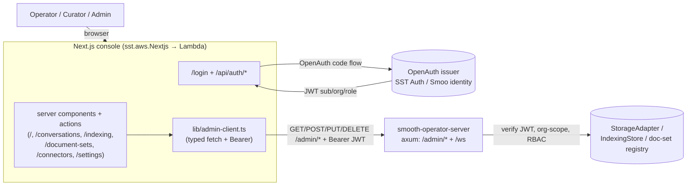

<p align="center">
  
</p>

<h1 align="center">Smooth Operator — Management Console</h1>

The **management console** for `smooth-operator` (Phase 12, increment 2): a
Next.js 15 (App Router, TypeScript, Tailwind) admin UI that consumes the
auth-gated [`/admin/*` API](../docs/ADMIN-API.md) — whoami, chat history,
indexing status, and document sets — with org-scoping and RBAC inherited from the
backend.

Every page is a server component that constructs a typed
[`AdminClient`](./lib/admin-client.ts) bound to the signed-in user's bearer token
and renders the JSON. **Read** surfaces (dashboard, conversations, indexing,
document sets) plus the **write** surfaces (connector add/edit/delete + "Index
now", and an editable agent-settings form — Phase 12 increment 4) are all backed
by the [`/admin/*` write API](../docs/ADMIN-API.md). Mutations run through Next.js
server actions and inherit the backend's RBAC: viewing is Curator+, "Index now" is
Curator+, and creating/editing/deleting connectors + saving settings is **Admin**
(the UI hides the controls a role can't use; the server re-enforces every gate).



---

## Quickstart (dev)

Point the console at a local `smooth-operator-server` running with
`AUTH_MODE=none` (a fixed Admin principal — no token needed) and a seeded KB:

```bash
# 1. Boot the backend (from the repo's rust/ dir).
AUTH_MODE=none SMOOTH_AGENT_PORT=8840 SMOOTH_AGENT_SEED_KB=1 \
  cargo run -p smooai-smooth-operator-server
# (or run a prebuilt binary: rust/target/debug/smooth-operator-server)

# 2. Boot the console in dev-auth mode pointed at it
cd console
pnpm install
CONSOLE_AUTH=dev ADMIN_API_URL=http://127.0.0.1:8840 pnpm dev
# → http://localhost:3000  → "Continue as Admin"
```

In dev mode the login form mints a local session whose admin-API bearer is the
literal `dev`, which an `AUTH_MODE=none` server accepts. The dashboard then
reflects the fixed Admin principal returned by `/admin/me` and the seeded
`policies` document set.

---

## Auth modes

The console supports the same auth duality as the backend, switched by
`CONSOLE_AUTH`:

| Mode | `CONSOLE_AUTH` | Backend `AUTH_MODE` | How it works |
| --- | --- | --- | --- |
| **OpenAuth (BYO)** | *(default / `openauth`)* | `jwt` | `/api/auth/login` redirects to the SST OpenAuth issuer (OAuth code flow). `/api/auth/callback` exchanges the code for the OpenAuth-issued JWT (carrying `sub`/`org`/`role`), stored in an httpOnly session cookie and forwarded as the admin-API bearer. |
| **Smoo identity (hosted)** | `openauth` | `smoo` | Identical flow, but `OPENAUTH_ISSUER` points at Smoo's hosted issuer (`lom.smoo.ai`) instead of a self-hosted `sst.aws.Auth`. Same JWT contract. |
| **Dev** | `dev` | `none` | A username form mints a local session with the bearer `dev`. Only reachable when `CONSOLE_AUTH=dev`; never the production default. Used by the smoke test. |

The console **never trusts the token itself** — it only forwards it. The admin
API re-verifies the JWT on every request (its `JwtVerifier`), which is the real
trust boundary. The OpenAuth path decodes the JWT payload only for a display
hint (signed-in name/role), and the role is also re-resolved live via
`/admin/me` in the app layout.

### Role-awareness (RBAC)

The signed-in role (`admin` ≥ `curator` ≥ `basic`) drives the UI:

- The **header** shows the user, org, and a role badge.
- The **sidebar** hides Curator-only sections (Indexing) from Basic users
  ([`lib/rbac.ts`](./lib/rbac.ts)).
- The **dashboard** shows knowledge cards only to Curator+; a Basic user sees a
  "available to Curator and Admin" notice instead.
- Any `403` from the admin API (e.g. a Basic user reaching a Curator surface)
  renders as a friendly "Insufficient permissions" error rather than a raw code.

---

## Pages

| Route | What |
| --- | --- |
| `/` | Dashboard — overview cards: conversation count, signed-in user/role (`/admin/me`), document-set + indexing summaries (Curator+), recent indexing activity. |
| `/conversations` | Paged conversation list (offset paging via `nextCursor`). |
| `/conversations/[id]` | Conversation detail — the message transcript (`/admin/conversations/{id}/messages`). |
| `/indexing` | Indexing runs table (Curator+) — status, counts, cursor, started/finished. |
| `/document-sets` | Document set cards — names + document counts (Curator+). |
| `/connectors` | Connectors list (Curator+ to view): name / kind / source / enabled / updated. Per-row **Index now** (Curator+) surfaces the returned run's status + counts inline and links to `/indexing`; **Edit** / **Delete** (Admin, delete behind a confirm). Admin sees a **+ New connector** button. |
| `/connectors/new` | Add-connector form (Admin) — pick `kind`, then kind-specific fields. |
| `/connectors/[id]/edit` | Edit-connector form (Admin) — prefilled from the stored config (`kind` is immutable on edit). |
| `/settings` | **Editable** agent settings (model, system-prompt textarea, default-tools list) — Admin saves via `PUT /admin/settings`, Curator views read-only — plus a read-only block of backend health + deploy config. |
| `/login`, `/api/auth/*` | Auth: dev login server action; OpenAuth login/callback/signout route handlers. |

Every data page handles loading / empty / error states explicitly. Validation
`400`s from the write API (the protocol `VALIDATION_ERROR` shape) surface inline
on the relevant form.

### Connector config + the `auth_ref` secret model

A connector's `config` is a kind-specific, free-form payload:

| `kind` | required | optional |
| --- | --- | --- |
| `github` | `owner`, `repo` | `include` (`{prose, code, issues}` toggles), `ref`, `visibility` (`public`/`private`), `auth_ref` |
| `web` | `url` | — |
| `file` | `path` | — |

**`auth_ref` is a secret NAME** (e.g. `GITHUB_TOKEN`), **never the token itself**.
The connector form collects it as a name only; the backend resolves it from
env / `@smooai/config` at index time, uses it to build the live connector, and
discards it — it is never persisted in the config store nor returned by any
`GET`. A private GitHub repo requires an `auth_ref`; a public repo may index
unauthenticated.

### "Index now"

`POST /admin/connectors/{id}/index` (Curator+) builds the live connector from its
stored config and runs **one** indexing pass with the network-free default
chunker/embedder, returning the resulting `IndexingRun`. The list page's "Index
now" button surfaces that run's status + `documents seen` / `chunks indexed`
inline and links to the full `/indexing` table (the run is recorded in the shared
indexing store, so it shows there too). For a `file` / public `web` connector this
is fully offline; for a private repo an unresolvable `auth_ref` returns a clean
`400` (surfaced inline) before any network call.

---

## Admin API client

[`lib/admin-client.ts`](./lib/admin-client.ts) is a typed fetch wrapper over each
`/admin/*` endpoint. It takes a base URL + bearer token, sends
`Authorization: Bearer <token>`, parses into the shapes declared in
[`lib/types.ts`](./lib/types.ts) (mirroring the Rust serde output — camelCase),
and throws a typed `AdminApiError` (carrying HTTP status + protocol error code)
on failure so UI code branches on `isUnauthorized` / `isForbidden` / `isNotFound`
without re-parsing the body. The domain shapes (`Conversation`, `Message`,
`ContentItem`, `ParticipantRef`) match the published `@smooai/smooth-operator`
client so the two can be unified later.

**Read** methods: `me`, `conversations`, `conversationMessages`, `indexingRuns`,
`documentSets`, `listConnectors`, `getConnector`, `getSettings`. **Write** methods
(increment 4): `createConnector`, `updateConnector`, `deleteConnector`,
`indexConnector` (→ `IndexingRun`), `putSettings`. The write responses are
unwrapped from their `{ connector }` / `{ run }` / `{ settings }` envelopes; the
client surfaces the same `AdminApiError` so a `400 VALIDATION_ERROR` reaches the
form. The mutating calls are invoked from server actions
([`app/(app)/connectors/actions.ts`](./app/(app)/connectors/actions.ts),
[`app/(app)/settings/actions.ts`](./app/(app)/settings/actions.ts)) that
`revalidatePath` the affected pages.

---

## Tests

Live Playwright smoke tests ([`e2e/console.smoke.spec.ts`](./e2e/console.smoke.spec.ts)),
gated on `SMOOTH_AGENT_E2E=1` like the repo's other live tests. They boot a
`smooth-operator-server` (`AUTH_MODE=none`) and `next start` the console
(`CONSOLE_AUTH=dev`) against it, signing in via the dev login.

- **Read smoke** (port 8840 / console 3939, `SMOOTH_AGENT_SEED_KB=1`): the
  dashboard renders the Admin principal and the seeded `policies` document set.
- **Write-flow smoke** (port 8841 / console 3940): drives the Admin UI through
  **create** a connector via the form → it appears in the list → **edit** (rename)
  → persists on re-fetch → **Index now** on a `file` connector pointing at a temp
  dir the test creates (fully offline, no network/gateway) → a `succeeded` run
  surfaces inline and in `/indexing` → **edit settings** (change the model) → Save
  → re-fetch reflects it → **delete** the connector → it's gone.

Both skip cleanly without the env and never print secrets.

```bash
pnpm build                       # next build (required — the test next-starts the build)
SMOOTH_AGENT_E2E=1 pnpm test:e2e
```

```bash
pnpm typecheck   # tsc --noEmit
pnpm lint        # next lint
pnpm build       # next build
```

---

## SST deploy

[`sst.config.ts`](./sst.config.ts) declares an `sst.aws.Nextjs` (OpenNext →
Lambda + CloudFront) for the console, an `sst.aws.Auth` for the BYO OpenAuth
issuer, and wires the admin API URL + issuer URL into the site env. **Never
deploy locally** — CI owns deploys; verification here is `tsc` / `sst` synth.

The reusable wiring could later move into a `Console` construct in
`@smooai/deploy` (alongside the existing `SmoothAgentApi`). Env the deploy sets:

| Env | Meaning |
| --- | --- |
| `CONSOLE_AUTH` | `openauth` (prod) — the dev path is never deployed. |
| `ADMIN_API_URL` | Base URL of the running `smooth-operator-server`. |
| `OPENAUTH_ISSUER` | The SST OpenAuth issuer URL (or `lom.smoo.ai` for hosted Smoo identity). |
| `OPENAUTH_CLIENT_ID` | The OpenAuth client id. |
| `BACKEND_AUTH_MODE` | The backend's auth mode (display, settings page). |

---

## Next

- Document-set management (rename / delete / re-tag) — needs admin endpoints.
- Persistent connector-config + settings stores (the backend ships in-memory
  stores; the Postgres/DynamoDB follow-ups are tracked in
  [`docs/ADMIN-API.md`](../docs/ADMIN-API.md)).
- Wire the real `sst.aws.Auth` issuer Lambda + the `SmoothAgentApi` URL output.
