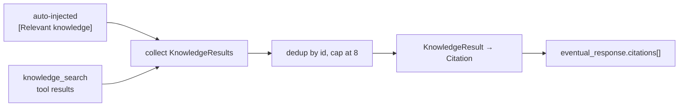

# Citations

A grounded answer carries the sources it used. The terminal `eventual_response`
gains an **optional** `citations` array alongside `response` / `needsEscalation`,
so a UI can link an answer straight back to the file or issue it came from.

## The shape

A `Citation` is `{ id, title, url?, snippet, score }`
(schema: [`spec/domain/citation.schema.json`](../../spec/domain/citation.schema.json)):

```jsonc
{
  "type": "eventual_response",
  "data": { "data": {
    "response": { "responseParts": ["Returns are accepted within 30 days…"] },
    "needsEscalation": false,
    "citations": [{
      "id": "doc-returns-policy",
      "title": "acme/handbook@main#policies/returns.md",
      "url": "https://github.com/acme/handbook/blob/main/policies/returns.md",
      "snippet": "SmooAI returns are accepted within 30 days…",
      "score": 0.91
    }]
  } }
}
```

## What grounds a citation



The runtime collects the knowledge-base documents that actually grounded the turn
— the engine's auto-injected `[Relevant knowledge]` context (mirrored with the
same top-K query) **plus** every `knowledge_search` tool result. It deduplicates
by `id`, caps the count at 8, and maps each `KnowledgeResult` → `Citation`:

| Citation field | Source |
| --- | --- |
| `id` | `document_id` (the dedup key) |
| `title` | `source` (the document's source label) |
| `url` | `source` **when it is an `http(s)` URL** — the GitHub blob/issue URL stamped at ingest (see [[Connectors]]); omitted otherwise (e.g. an uploaded file with a plain path) |
| `snippet` | the retrieved chunk, truncated |
| `score` | the relevance (similarity) score |

## Where the URL comes from

The [[Connectors|GitHub connector]] stamps each document's `source` with its
**blob URL** (prose/code) or **issue/PR URL** (issues). When the agent grounds an
answer in a GitHub-sourced chunk, that URL flows straight through to the
citation's `url`. Documents whose `source` isn't an `http(s)` URL simply omit it.

## Back-compat

`citations` is **absent** when the turn retrieved nothing, so clients that predate
it are unaffected. Generated clients expose it as an optional `Citation` field
after regenerating from `spec/`.

## Related

- [[Protocol Reference]] — the `eventual_response` event + the inline `citations` shape.
- [[Connectors]] — where the blob/issue URL is stamped onto `source`.
- [[Knowledge and RAG]] — the retrieval that produces the grounding documents.
