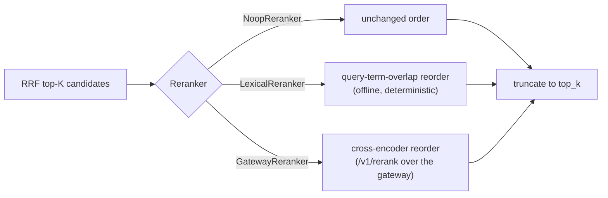

# Reranking

After [[Knowledge and RAG|hybrid retrieval]] (dense ∪ sparse → RRF), the fused
top-K can be **optionally** reordered by a sharper query↔candidate relevance model
before it reaches the LLM's context. This is the `Reranker` seam
(`smooth_operator::rerank`, feature gap G8 — ✅ implemented). It is **off by
default**; turning it on is opt-in and, when unset, retrieval is byte-for-byte
unchanged.

## The seam

The `Reranker` trait is `rerank(query, candidates, top_k)`, with three impls:

| Impl | Where | What |
| --- | --- | --- |
| `NoopReranker` | core | identity — wiring it in changes nothing (what makes the stage opt-in). |
| `LexicalReranker` | core | deterministic, network-free query-term-overlap / BM25-ish lexical score — offline-testable. |
| **`GatewayReranker`** | adapter crate (with `GatewayEmbedder`) | production cross-encoder: POSTs a Cohere/Voyage-style `{ model, query, documents, top_n }` to the gateway's `/v1/rerank`, reorders by the returned relevance score, truncates. |

## Selection + wiring

The server-side `build_reranker(RerankerConfig)` selector (mirrors `build_embedder`)
chooses **gateway-when-keyed / lexical / off** from the `SMOOTH_AGENT_RERANK` env
(`gateway` | `lexical` | unset ⇒ off), returning `None` by default. Both the
reference WS server and the Lambda dispatch select through it and thread it onto
the turn request.

It's wired into the `knowledge_search` tool behind
`KnowledgeSearchTool::with_reranker(...)`: when set, the tool **over-fetches**
candidates (`limit × 4`) and reorders them; when unset (the default) behavior is
unchanged.

## Never panics, never drops the turn

A quality stage must not be able to break a turn. On **any** failure — network,
non-2xx, malformed response, out-of-range index — `GatewayReranker` degrades to
the **input order** truncated to `top_k`, logging a `tracing::warn!`. It's generic
over a `RerankBackend` seam (production = `HttpRerankBackend`) so unit tests inject
a stub and exercise reorder / truncate / error-fallback offline.

## Configuration

| Env | Values | Effect |
| --- | --- | --- |
| `SMOOTH_AGENT_RERANK` | `gateway` \| `lexical` \| *(unset)* | gateway cross-encoder / offline lexical / **off** (default). |
| `SMOOAI_GATEWAY_URL` / `SMOOAI_GATEWAY_KEY` | — | base + key for `gateway` mode (shared with the embedder). |

Full env reference: [[Configuration]].

## Related

- [[Knowledge and RAG]] — where rerank sits in the retrieval pipeline.
- [[Storage Adapters]] — the embedder + rerank seam in detail.
- [[Feature Gaps]] — G8.
