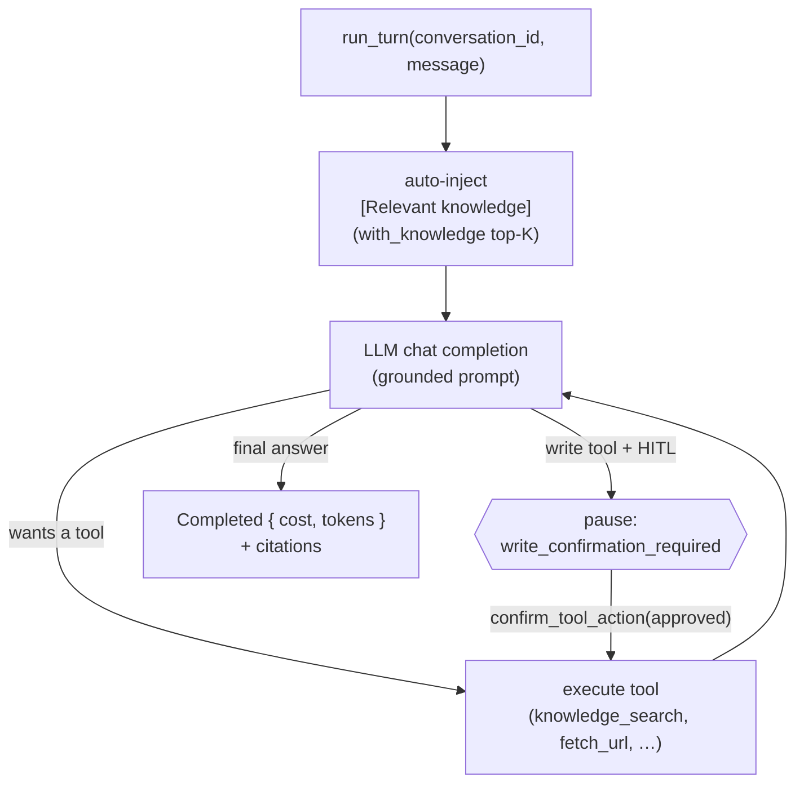
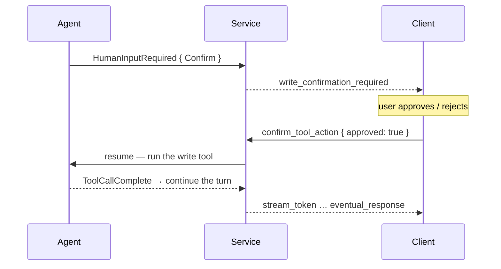

# Agents, Tools, and Workflows

This page is the mental model for **how a turn actually runs** — the agent loop,
the tools it can call, and the human-in-the-loop (HITL) pauses. The reference
runtime is `KnowledgeChatRuntime` (`rust/smooth-operator/src/runtime.rs`), a
[[Engine and Service|smooth-operator-core]] `Workflow` that drives a real
`Agent::run` loop.

## The agent loop

Each turn:

1. The runtime **auto-injects** the top-K relevant knowledge snippets as context
   before the first LLM call (the engine's `with_knowledge`).
2. The model runs; it may **call tools** (the engine loops tool→model until the
   model is done, capped by `SMOOTH_AGENT_MAX_ITERATIONS`).
3. A tool that **writes** triggers a HITL confirmation pause (below).
4. On completion the runtime emits a `gen_ai.chat` [[Observability|span]], persists
   the message, and collects [[Citations|citations]] from what actually grounded
   the answer.

The runtime reads knowledge through an access-controlled handle so neither the
auto-injected context nor a `knowledge_search` result can leak a restricted
document — see [[Access Control]].

## Tools

A **tool** is anything implementing the engine's `Tool` trait: a `schema()` (name,
description, JSON-Schema parameters — what the *model* sees) and an `execute()`
that returns a string the model reads next turn. The built-in catalog:

| Tool | What | Read-only |
| --- | --- | --- |
| `knowledge_search` | top-K KB snippets over the [[Storage Adapters|storage adapter]] | ✅ |
| `conversation_history` | recent messages of the *current* conversation | ✅ |
| `fetch_url` | readable text of a **public** page (with an SSRF guard) | ✅ |
| `web_search` | hits via a pluggable provider (Noop by default) | ✅ |
| `github_search` | **live** GitHub code/issue search (registered separately) | ✅ |

The `description` is the model's only guidance on *when* to call a tool — write it
for the model. Full shapes, the SSRF guard, and how to author your own:
[[Tools]] and [[Writing a Connector]].

## Human-in-the-loop (HITL)

A tool flagged as a write (or behind an auth gate) doesn't run silently. The
engine's `human` module surfaces a `HumanRequest`, which the service maps to a
protocol event the client must answer:

The OTP variant (`otp_verification_required` → `verify_otp`) gates auth-sensitive
tools the same way. The resumed stream flows back into the **same** turn handle on
every client. See [[The Protocol]] for the lifecycle and [[Protocol Reference]]
for the exact events.

## Workflows

`KnowledgeChatRuntime` is one `Workflow`. The broader smooai agent pipeline
(intake → guardrails → knowledge_search → response_gen → tool_execution →
structure_response → escalation → analytics → memory_update) is re-expressed as a
`Workflow` of nodes + conditional edges — that build-out is tracked on the
[[Roadmap]]. The point of the `Workflow` abstraction: nodes, conditional edges,
and durable checkpoints, so a turn can pause (HITL) and resume on the next message.

## Related

- [[Tools]] — the catalog + authoring guide + the SSRF guard.
- [[Knowledge and RAG]] — what `knowledge_search` retrieves over.
- [[Conversations and Sessions]] — checkpoints and per-session memory.
- [[Protocol Reference]] — the streamed events for each step.
