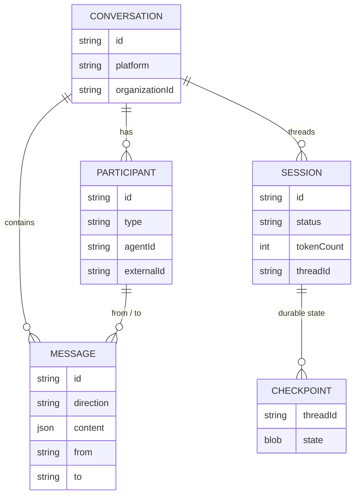
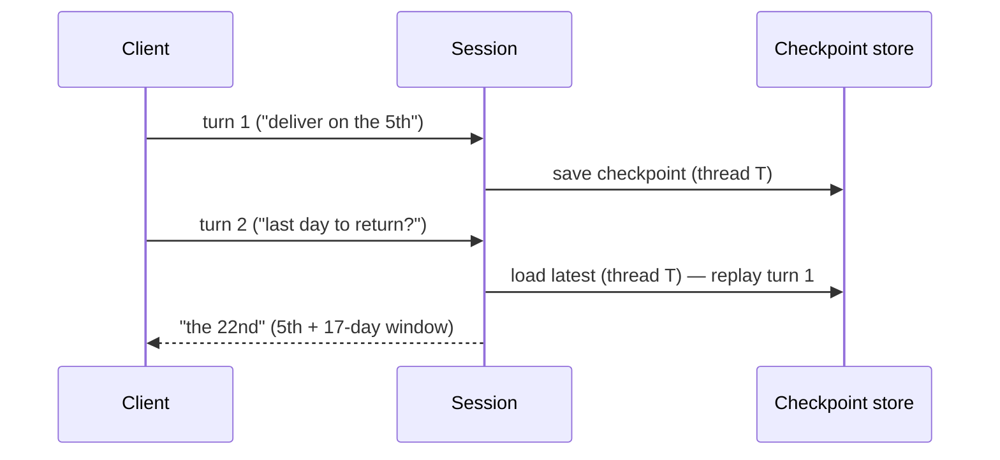

# Conversations and Sessions

The data model behind every turn. It's lifted from the smooai monorepo's schema
and made **storage-agnostic** — the same shapes map onto Postgres tables (k8s) or
a DynamoDB single table (AWS). The mappings are in [[Storage Adapters]].

## The five entities

- **Conversation** — one thread of contact: `id`, `platform`
  (web / sms / email / discord / phone / slack / whatsapp / …), `organizationId`
  (the coarse tenant boundary — see [[Access Control]]), metadata.
- **Participant** — a three-way discriminated type: **`user`** | **`ai-agent`** |
  **`human-agent`**. An `ai-agent` carries the agent id; a `user` optionally
  carries an external auth id (used by "Basic sees own" in the [[Admin API]]) and
  a CRM contact id. The `human-agent` type is what makes escalation / multi-party
  support conversations a first-class shape, not a bolt-on.
- **Message** — `direction` (`inbound`/`outbound`), `content` (`{ items: [{type, text}] }`),
  `from`/`to` participant ids, analytics.
- **Session** — one live "thread": it **bridges a conversation to a
  [[Engine and Service|smooth-operator-core]] checkpoint thread** (it's what
  replaces a LangGraph thread id). Tracks status, token/message counts, and the
  rate-limit window.
- **Checkpoint** — durable agent state per thread (the engine's `Checkpoint`),
  so a turn can pause for HITL and resume on the next message.

## Why the session matters

A turn isn't stateless. The session carries the **per-session agent identity** so
the agent remembers earlier turns — the runtime replays prior messages
(`with_prior_messages`) and keeps a stable per-session agent id. (This is the
defect the [[Evals|LLM-as-judge]] caught: a fresh agent per turn forgot turn 1's
context and scored 1/5 on a multi-turn question; per-session memory fixed it →
5/5.)

## Connection state

Beyond the durable model, the service tracks ephemeral **WebSocket connection
state** (mirroring the smooai key patterns): `connection → session`,
`session → connections` (fan-out / ownership), `user → connections`,
`agent → connections`, and the session blob. On AWS this lives in DynamoDB
(TTL'd) or optional Redis; on k8s in Postgres or Redis. Keys and shapes are in
[[Protocol Reference]] and [[Storage Adapters]].

## Related

- [[Storage Adapters]] — how these entities map onto each backend.
- [[Agents, Tools, and Workflows]] — checkpoints + HITL resume.
- [[Admin API]] — org-scoping and "Basic sees own" over this model.
- [[Access Control]] — `organizationId` isolation + document ACLs.
