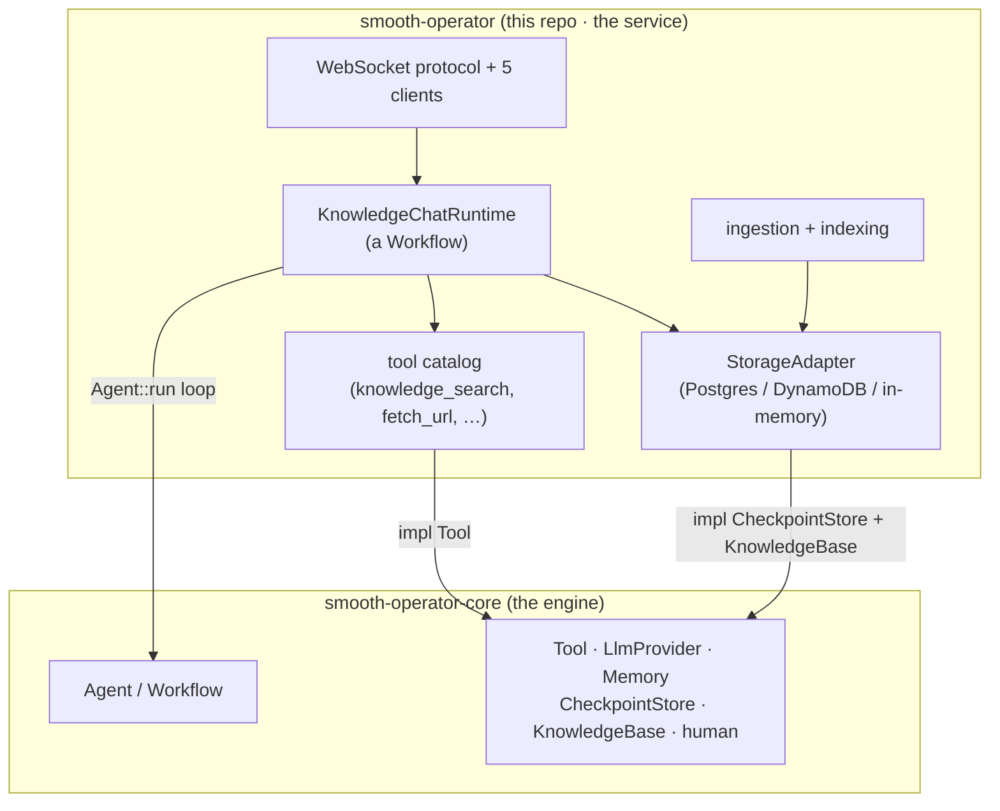

# Engine and Service

smooth-operator is **two repositories** with a clean seam between them. Keeping
the generic agent engine separate from the knowledge-assistant service is the
single most important structural decision in the project.

| Repo | Crate | What it is |
| --- | --- | --- |
| [`smooth-operator-core`](https://github.com/SmooAI/smooth-operator-core) | `smooai-smooth-operator-core` (**v0.14.0** on [crates.io](https://crates.io/crates/smooai-smooth-operator-core)) | The **agent engine** — generic, app-agnostic: `Agent`, `Workflow`, `Tool` / `ToolRegistry`, `LlmProvider`, `Memory`, `CheckpointStore`, `KnowledgeBase`, the `human` (HITL) module, cost accounting. **408 tests.** |
| **`smooth-operator`** (this repo) | `smooai-smooth-operator` (lib `smooth_operator`) | The **service** — conversations, knowledge ingestion + retrieval, the tool catalog, the WebSocket protocol, the five clients, and the AWS/k8s deploy paths. **126 service tests.** |

> **What the engine is *not*.** `smooth-operator-core` is a *generic* agent
> engine. The `th code` coding harness (microsandbox / operatives / Big-Smooth)
> was **extracted out** of it and lives only in the private `smooth` monorepo —
> it is **not** part of smooth-operator or its engine. Everything documented in
> this vault is the generic engine + the knowledge-assistant service on top of it.

## The dependency direction

The service **depends on** the engine, never the other way around. The service's
[[Storage Adapters|storage adapters]] *implement* the engine's `CheckpointStore`
and `KnowledgeBase` traits, so the engine plugs straight in with no knowledge of
Postgres or DynamoDB. The service's [[Tools|tools]] *implement* the engine's
`Tool` trait.

## How the service uses the engine

The mapping from a LangGraph-style agent graph to the engine's primitives is
direct (the smooai monorepo runs LangGraph today; smooth-operator replaces it):

| LangGraph concept | engine primitive |
| --- | --- |
| `StateGraph` / `Annotation.Root` | `Workflow<S>` / `WorkflowBuilder<S>` |
| graph node | `Node<S>` (or `FnNode<S>`) |
| conditional edge | `EdgeTarget::Conditional` |
| `PostgresSaver` checkpointer | `CheckpointStore` (Memory / File / SQLite / Postgres / **DynamoDB**) |
| long-term memory store | `Memory` trait |
| tool bound to model | `Tool` + `ToolRegistry` |
| streaming graph events | the `AgentEvent` stream |
| HITL write-confirmation / OTP | the `human` module — `HumanRequest::Confirm`, `ConfirmationHook` |

The reference runtime today is `KnowledgeChatRuntime` (a `Workflow` that runs a
real `Agent::run` loop with knowledge auto-injection + a `knowledge_search` tool).
Re-expressing the full nine-node smooai pipeline as a `Workflow` is on the
[[Roadmap]]. Full detail: [[Architecture Overview]].

## Two postures, one codebase

Because the engine takes its LLM through an `LlmProvider` and its storage through
traits, the *same* service code runs **Smoo-powered** (hosted: `llm.smoo.ai`,
Smoo identity, managed connector apps) or **bring-your-own** (any
OpenAI-compatible gateway, your IdP, your tokens). This duality recurs everywhere
— see [[Overview]] and [[Configuration]].

## Related

- [[Overview]] — the big picture.
- [[The Protocol]] — why clients speak a wire protocol, not FFI.
- [[Agents, Tools, and Workflows]] — the engine's turn loop from the service's view.
- [[Architecture Overview]] — the full design + the LangGraph→engine mapping.
