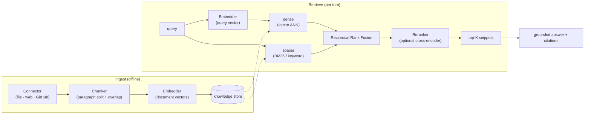

# Knowledge and RAG

How smooth-operator turns documents into grounded answers: **ingest → chunk →
embed → store → retrieve (hybrid) → optionally rerank → ground → cite**. This is
the concept overview; the deep docs are [[Ingestion Pipeline]], [[Storage Adapters]],
[[Reranking]], and [[Citations]].

## The pipeline, end to end

## Hybrid retrieval

Retrieval combines two signals and fuses them:

- **Dense** — embedding similarity (semantic). Provider-pluggable via the
  `Embedder` seam.
- **Sparse** — keyword / BM25 (lexical exact-match).
- **Fusion** — Reciprocal Rank Fusion (RRF) of the two rankings.
- **Rerank** *(optional)* — a cross-encoder reorders the fused top-K for sharper
  query↔candidate relevance. Off by default, opt-in. See [[Reranking]].

Backends (same retrieval contract, two implementations):

| | k8s / self-host | AWS serverless |
| --- | --- | --- |
| Dense | `pgvector` (HNSW cosine) | **Amazon S3 Vectors** |
| Sparse | `tsvector` BM25 | inverted index / managed search |

Why not raw DynamoDB for vectors? It has no ANN index — you'd brute-force scan
every item per query. The full reasoning + the single-table design is in
[[Storage Adapters]].

## The embedder seam — semantic vs. deterministic

The embedder is **selected from config**, never hardcoded:

- **`GatewayEmbedder`** (the production path) — a real semantic embedder
  (`text-embedding-3-small`, **1536-d**) over the SmooAI gateway's
  OpenAI-compatible `/v1/embeddings`, used when the gateway is keyed.
- **`DeterministicEmbedder`** (the offline fallback) — network-free FNV-1a token
  hashing → L2-normalized **1024-d**. *Not* semantic, but reproducible and
  credential-free, so dev and the test baseline run with zero API calls. The
  service logs a loud warning so a hash-stub index is never mistaken for a real one.

Document vectors (at ingest) and query vectors (at retrieval) must share *both* a
projection and a width, so the knowledge store's `vector(N)` column is always
created from the **active embedder's `dim()`** — the keyed (1536) and unkeyed
(1024) paths can never silently mix dimensions. Detail: [[Ingestion Pipeline]].

## Grounding and citations

The runtime feeds retrieved snippets to the model two ways: the engine's
auto-injected `[Relevant knowledge]` context, *and* the agent's own
`knowledge_search` tool calls. Both read through the **same** access-controlled,
optionally-curated handle, so a restricted or out-of-scope document can't reach
the model through either path. The documents that actually grounded the answer
become the [[Citations|citations]] on the terminal `eventual_response`.

## Curation: sets, boosting, filters

On top of retrieval, a service-layer curation stage (opt-in, default off) lets a
curator scope a query to named **document sets**, **boost** canonical docs above
merely-similar matches, and apply **query-time metadata filters** — all composing
with access control (ACL ∧ set ∧ metadata). See [[Document Sets]].

## Related

- [[Ingestion Pipeline]] — connectors, chunking, the embedder seam, idempotency.
- [[Indexing]] — running ingestion incrementally on a schedule.
- [[Storage Adapters]] — where knowledge lives; the S3-Vectors-vs-pgvector design.
- [[Reranking]] · [[Citations]] · [[Document Sets]] · [[Access Control]].
