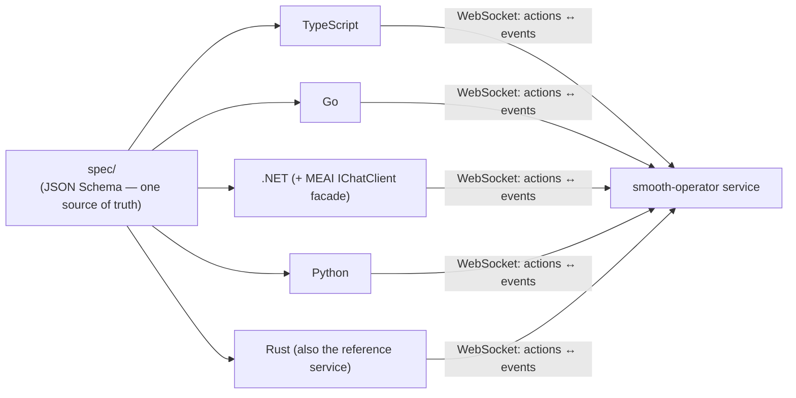
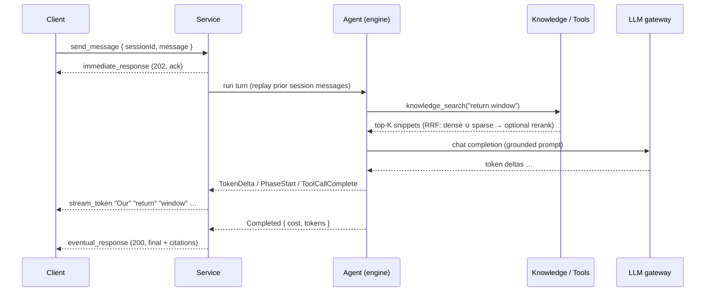

# Overview

**smooth-operator** is an open-source, serverless-native, **polyglot AI agent
service**. You give it knowledge (docs, code, a GitHub repo) and an LLM gateway;
it gives you a streaming, knowledge-grounded, tool-calling agent your apps reach
over **one WebSocket protocol** — from any of five languages, deployed to AWS
serverless *or* Kubernetes.

If you remember three things from this page:

1. **There's an engine and there's a service.** The generic agent engine is a
   separate crate (`smooai-smooth-operator-core`); this repo is the *service*
   around it. See [[Engine and Service]].
2. **The spine is a protocol, not a binary.** Clients never link the engine —
   they speak a schema-driven WebSocket protocol. One spec, five native clients.
   See [[The Protocol]].
3. **The seams are swappable.** Storage backend, embedder, reranker, web-search
   provider, auth mode, connector — each is a trait you can swap without touching
   agent code. "Same code, two postures" (Smoo-powered *or* bring-your-own) runs
   through everything.

---

## The one-protocol-five-clients idea

A client never names a language, a storage backend, or whether the engine is
embedded or remote. It only ever sees the **protocol** — a set of JSON *actions*
(client → server) and *events* (server → client) defined once as JSON Schema in
[`spec/`](../../spec). Each language regenerates its types from that spec and runs
the same shared conformance fixtures, so drift is caught in CI.

Why protocol-first instead of FFI codegen? `.NET` and Go are first-class targets
and the agent path is async + streaming-heavy, where cross-language async-FFI
generators are immature. So the protocol is the spine and each language ships an
idiomatic native client; in-process FFI is layered on only where embedding the
engine pays off. The full rationale is in [[The Protocol]].

---

## What a turn looks like

The model autonomously decides to call `knowledge_search`, retrieves the grounding
fact, and answers from it — then the terminal `eventual_response` carries the
[[Citations|sources it used]]. See [[Agents, Tools, and Workflows]] for the loop
and [[Knowledge and RAG]] for retrieval.

---

## The decomposition

smooth-operator keeps the clean **Chat · RAG/Knowledge · Agents · Actions(Tools)**
decomposition that mature knowledge platforms use, but drops the parts that don't
fit serverless (a standing Vespa cluster, persistent Redis/MinIO, a Celery worker
fleet) — replacing them with S3 Vectors / pgvector, DynamoDB / Postgres, and
event-driven Lambda / k8s Jobs. The full "what we kept and what we dropped" is in
[[Architecture Overview]].

| Capability | Smoo-powered (hosted) | Bring-your-own (self-host) |
| --- | --- | --- |
| LLM gateway | `llm.smoo.ai` | any OpenAI-compatible endpoint |
| Embeddings | gateway (`text-embedding-3-small`) | `DeterministicEmbedder` or your provider |
| Reranking | gateway `/v1/rerank` | `LexicalReranker` or off |
| Identity / RBAC | Smoo identity | SST OpenAuth / your IdP, or trusted proxy |
| Connectors | managed GitHub/Slack apps | your tokens, same `Connector` trait |

---

## Where to go next

- [[Engine and Service]] — the two-repo split in detail.
- [[Conversations and Sessions]] — the data model behind a turn.
- [[Access Control]] — who can see which documents, and the auth modes.
- [[Getting Started]] — run it locally in five minutes.
- [[Architecture Overview]] — the full system design.
