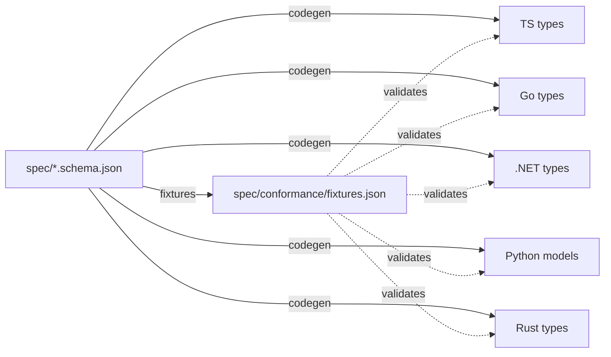
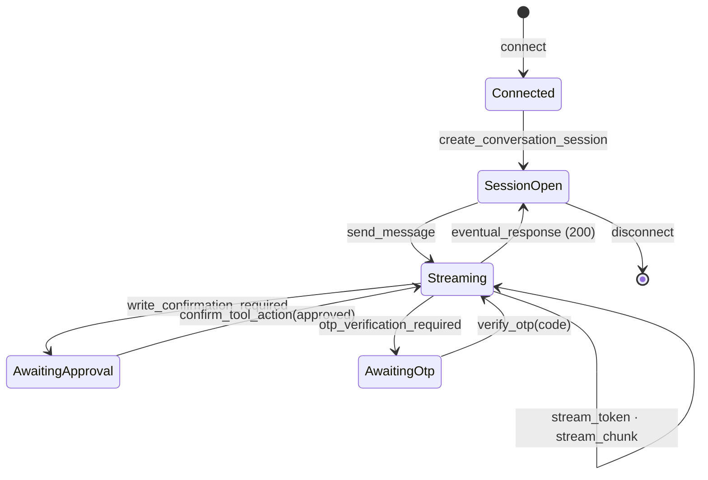

# The Protocol

The **protocol** is the spine of smooth-operator: a schema-driven WebSocket
contract between any client and any service, in any language. This page is the
*concept*; the full action/event tables are in the [[Protocol Reference]].

## Why protocol-first

`.NET` and Go are first-class targets, and the agent path is **async +
streaming-heavy** (token-by-token deltas, mid-turn tool calls, HITL pauses).
Generating idiomatic async streaming bindings across those languages via FFI is
immature and fragile. So smooth-operator makes the wire protocol the spine:

- [`spec/`](../../spec) defines the protocol **once**, as JSON Schema (draft 2020-12).
- Each language **regenerates native types** from that spec and ships an idiomatic
  client (discriminated unions, type guards, async iterators).
- A shared set of **conformance fixtures** validates every client against the
  same instances, so a schema change that isn't reflected in a client fails CI.
- In-process **FFI is an optimization**, layered on only where embedding the
  engine in the same process pays off — never the only way to use a language.



## The shape of a message

Client → server is an **action**; server → client is an **event**:

```jsonc
// action (client → server)
{ "action": "send_message", "requestId": "…", "sessionId": "…", "message": "…" }

// event (server → client)
{ "type": "stream_token", "requestId": "…", "status": 202, "token": "Hel", "timestamp": 1733600000000 }
```

`requestId` correlates an action with all the events it produces. `status` is
HTTP-like: **202** = ack / in-progress, **200** = the final `eventual_response`.

## The lifecycle (including HITL)



A turn streams tokens and per-node chunks; if a tool wants to **write**, the turn
pauses with `write_confirmation_required` and resumes on `confirm_tool_action` —
the resumed stream flows back into the *same* turn handle. See
[[Agents, Tools, and Workflows]] for the human-in-the-loop story end to end.

## It maps onto the engine's event stream

The service subscribes to the engine's `AgentEvent` stream and translates each
event to a protocol event (`Started` → `immediate_response`, `TokenDelta` →
`stream_token`, `ToolCallComplete` → `stream_chunk`, `Completed` →
`eventual_response`, …). The full mapping table is in the [[Protocol Reference]].

## Transport-agnostic

The protocol defines *messages*, not a socket. Today that's WebSocket + JSON
(API Gateway WebSocket on AWS; any WS server on k8s). A gRPC + MessagePack binding
for low-overhead internal hops is a [[Roadmap|stretch goal]] — the same messages,
a different transport. Each client has a pluggable `Transport`, which is also how
tests drive real client code (correlation, parsing, HITL routing) with no network.

## Related

- [[Protocol Reference]] — the full action/event tables + `AgentEvent` mapping + connection state.
- [[Using the Polyglot Clients]] — how to drive a turn from each language.
- [[Citations]] — the `citations[]` payload on the terminal event.
- [[Engine and Service]] — what's behind the protocol.
