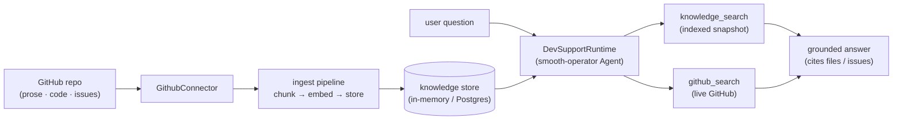

# Build a Dev-Support Agent

The `examples/dev-support` example is the smooth-operator **showcase**: point it at
a GitHub repository, `ingest`, and you have a support agent that answers questions
about that codebase — its **code**, its **docs**, and its **issue history** —
citing the files and issues it used. It's a real, compiling, tested CLI built on
the [[Ingestion Pipeline|ingestion pipeline]] + [[Agents, Tools, and Workflows|agent runtime]].

Source: [`rust/examples/dev-support/`](../../rust/examples/dev-support/README.md).

## How it works



- **Ingest** — `GithubConnector` pulls READMEs / `docs/` / `*.md` (prose), source
  files (code), and issues/PRs. The pipeline chunks, embeds, and stores each chunk.
  Re-runs are idempotent on `(doc id, content hash)`.
- **Chat** — `DevSupportRuntime` wires that knowledge into a real
  [[Engine and Service|smooth-operator]] `Agent` three ways: (1) the engine
  **auto-injects** top matches as context, (2) the agent can call **`knowledge_search`**
  on the index, and (3) it can call **`github_search`** for the *live* state of the
  repo (anything newer than the last ingest).

## Quickstart

```sh
# 1. Bring your credentials (secrets stay in the environment, never the config).
export GITHUB_TOKEN=ghp_…          # a GitHub PAT — read scope is enough
export SMOOAI_GATEWAY_KEY=…        # your llm.smoo.ai gateway key

# 2. Point dev-support.toml at YOUR repo.
#    [github]
#    owner = "your-org"
#    repo  = "your-repo"
#    auth  = "token"               # or "none" for public repos
$EDITOR dev-support.toml

# 3. Ingest the repo (prose + code + issues) into a knowledge store.
cargo run -p smooai-smooth-operator-example-dev-support -- ingest

# 4. Chat — grounded in the repo.
cargo run -p smooai-smooth-operator-example-dev-support -- chat
```

> The default `dev-support.toml` points at a small **public** repo with
> `auth = "none"`, so `ingest` runs out of the box with no `GITHUB_TOKEN`.

## The chat-widget UI — `serve`

`serve` does the whole thing in one command: it **ingests the configured repo on
boot** and then **runs the real `smooth-operator-server`** over that knowledge —
so the embeddable [`@smooai/chat-widget`](https://github.com/SmooAI/chat-widget)
can connect and chat, grounded in your repo. It calls the server crate's serve loop
**as a library** (it does not reimplement the WS protocol):

```sh
export SMOOAI_GATEWAY_KEY=…
cargo run -p smooai-smooth-operator-example-dev-support -- serve
# ✓ dev-support is serving rust-lang/mdBook
#   WebSocket: ws://127.0.0.1:8787/ws
#   <smoo-chat-widget mode="fullpage" endpoint="ws://127.0.0.1:8787/ws"></smoo-chat-widget>
```

`AUTH_MODE=none` (the local-dev default) serves the repo's **org-public** knowledge
to anonymous widget connections. Set `AUTH_MODE=jwt` + a key to gate retrieval per
principal — the server already enforces the per-connection document
[[Access Control|ACL]].

## Config + posture

Everything lives in `dev-support.toml` (secrets read from env, so the file is safe
to commit): the repo + auth mode + content tiers (`[github]`), and the model +
system prompt + enabled tools (`[agent]`).

- **Smoo-powered** — at [lom.smoo.ai](https://lom.smoo.ai), Smoo's first-party
  GitHub App wires repo access in one click (per-customer installation, no PAT to
  rotate) via `GithubAuth::AppInstallation`.
- **BYO (self-host)** — a PAT (`auth = "token"` + `$GITHUB_TOKEN`) or public-only
  (`auth = "none"`). Same code path.

## Persistence

The demo uses an **in-memory** store (gone on exit) for zero setup. For
persistence, set `SMOOTH_AGENT_STORAGE=postgres` + a connection string and `serve`
ingests into the [[Storage Adapters|Postgres (pgvector) adapter]] — same connector
and pipeline code, only the `StorageAdapter` changes.

## Related

- [[Ingestion Pipeline]] — the pull → chunk → embed → store pipeline.
- [[Connectors]] — the GitHub connector + the `github_search` tool.
- [[Document Sets]] — how dev-support tags a repo into a scoped set.
- [[Writing a Connector]] — author your own source.
