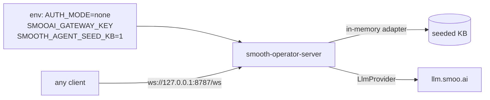

# Getting Started

Clone, run the reference Rust server, and drive a real agent turn locally — in
about five minutes. This is the `AUTH_MODE=none` dev path (admin open, no token);
for production auth see [[Self-Hosting]] and [[Integrating into an Existing App]].

## Prerequisites

- Rust (stable) + `cargo`.
- An OpenAI-compatible **LLM gateway key**. Hosted users get one from
  [lom.smoo.ai](https://lom.smoo.ai) (`SMOOAI_GATEWAY_KEY`); self-hosters point
  `SMOOAI_GATEWAY_URL` at any compatible endpoint and use that provider's key.

> The server **boots without a key** and answers every protocol action — only
> `send_message` (which needs the LLM) errors cleanly (`LLM_UNAVAILABLE`) until
> `SMOOAI_GATEWAY_KEY` is set.

## 1. Clone both repos side by side

The Rust service builds against the [[Engine and Service|engine]] crate via a
**sibling path dependency** (`rust/Cargo.toml` → `../../smooth-operator-core/...`),
so clone the engine **next to** this repo, not inside it:

```text
~/dev/
├── smooth-operator/          # this repo
└── smooth-operator-core/     # the engine — sibling, NOT a child
```

```bash
git clone https://github.com/SmooAI/smooth-operator-core
git clone https://github.com/SmooAI/smooth-operator
cd smooth-operator/rust
```

## 2. Run the reference server

```bash
export AUTH_MODE=none                 # dev only — boots /ws with /admin open
export SMOOAI_GATEWAY_KEY=sk-…        # your llm.smoo.ai key (talks to the real gateway)
export SMOOTH_AGENT_SEED_KB=1         # seed a distinctive "17-day return window" doc

cargo run -p smooai-smooth-operator-server
# → smooth-operator-server listening on ws://127.0.0.1:8787/ws (model claude-haiku-4-5)
```



No database to provision — the reference server uses the **in-memory adapter**.
Swap in Postgres or DynamoDB when you deploy ([[Self-Hosting]]).

## 3. Drive a turn

Connect any [[Using the Polyglot Clients|client]] to `ws://127.0.0.1:8787/ws`
(note the `/ws` path). In TypeScript:

```ts
import { SmoothAgentClient } from '@smooai/smooth-operator';

const client = new SmoothAgentClient({ url: 'ws://127.0.0.1:8787/ws' });
await client.connect();

const session = await client.createConversationSession({ agentId, userName: 'Alice' });
const turn = client.sendMessage({ sessionId: session.sessionId, message: 'How long is your return window?' });

for await (const ev of turn) {
  if (ev.type === 'stream_token') process.stdout.write(ev.token ?? '');  // "Our return window is 17 days…"
}
const final = await turn; // EventualResponse — cost, tokens, messageId, citations
```

The model autonomously calls `knowledge_search`, retrieves the seeded **17-day**
fact, and grounds its answer in it. See [[Agents, Tools, and Workflows]] for what
happened inside the turn and [[Citations]] for the sources on `final`.

## 4. Want the full ingest → chat path?

The [[Build a Dev-Support Agent|dev-support example]] is the showcase: point it at
a GitHub repo, `ingest`, then `chat` (or `serve` the chat-widget UI) to ask
grounded questions about that codebase.

## Next

- [[Using the Polyglot Clients]] — the same turn in Go / .NET / Python / Rust.
- [[Self-Hosting]] — run it on AWS or Kubernetes with a real backend + auth.
- [[Integrating into an Existing App]] — wire it behind your own auth.
- [[Configuration]] — every env var.
