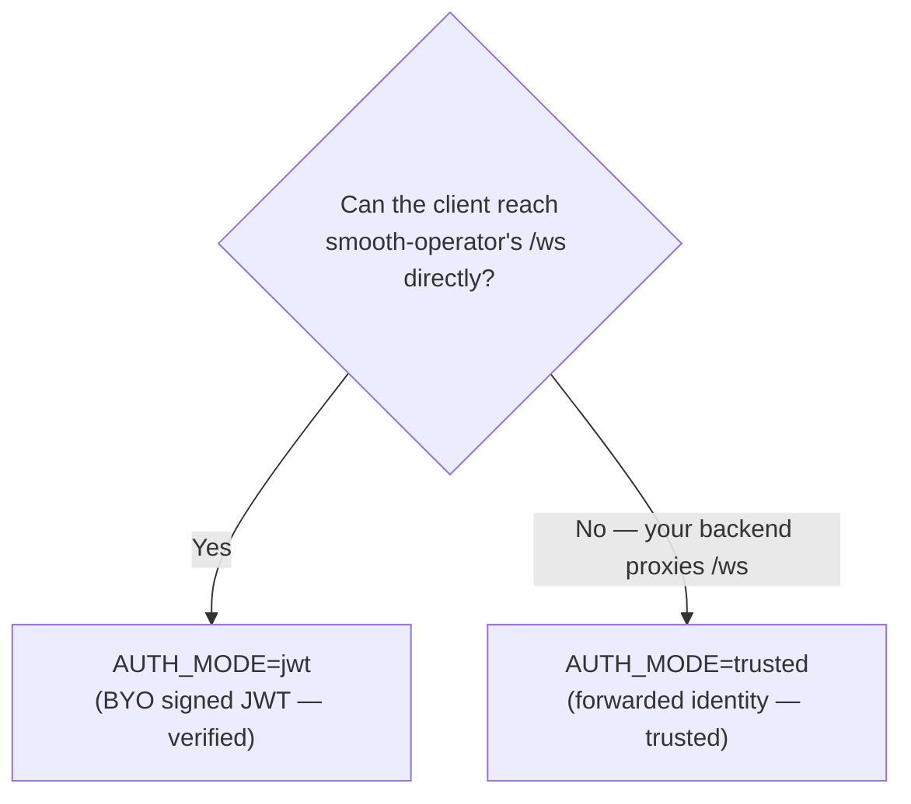

# Integrating into an Existing App

You already have an app with authenticated users, and you want to drop in a
smooth-operator agent (e.g. an embedded chat widget) **without** adopting its
identity provider. There are **two integration modes**, picked by whether your
clients can reach smooth-operator's `/ws` directly. The full model is in
[[Access Control]] and [[Authentication and RBAC]]; this is the decision + the
mint snippets.



Both modes carry the **same claim shape** (`sub` + `org` + `role` + `groups`),
which drives both RBAC (the [[Admin API]] role) and document [[Access Control|ACLs]]
(the `groups` gate retrieval). Both ride in the **same transport slot**: the
`?token=` query param on the reference server's `/ws` upgrade (browsers can't set
custom WS handshake headers), or the `send_message` `token` field on the Lambda.

## Mode 1 — BYO-JWT (`AUTH_MODE=jwt`)

Use when the **client connects directly** to `/ws`. Your backend mints a
**short-lived signed JWT**; smooth-operator **verifies** the signature + `exp` on
every connect.

**Server config:**

| Var | Value |
| --- | ----- |
| `AUTH_MODE` | `jwt` |
| `AUTH_JWT_RS256_PUBLIC_KEY` *or* `AUTH_JWT_HS256_SECRET` | your IdP's verification key |
| `AUTH_JWT_ISSUER` / `AUTH_JWT_AUDIENCE` | *(optional)* enforce `iss`/`aud` |

**The JWT your IdP issues** — `sub` + `org` + `role` + `groups` + `exp`:

```ts
import jwt from 'jsonwebtoken';

// On YOUR backend, after you've authenticated the user.
// Never ship the secret to the browser — mint server-side, hand only the token to the widget.
export function mintSmoothOperatorToken(user: {
    id: string; org: string; role: 'admin' | 'curator' | 'basic'; groups: string[];
}): string {
    return jwt.sign(
        { sub: user.id, org: user.org, role: user.role, groups: user.groups },
        process.env.AUTH_JWT_HS256_SECRET!,        // shared with the server's AUTH_JWT_HS256_SECRET
        { algorithm: 'HS256', expiresIn: '5m' },   // short-lived; exp is required + enforced
    );
}
// → hand the returned string to the widget as `wss://…/ws?token=<jwt>`.
```

## Mode 2 — Trusted proxy (`AUTH_MODE=trusted`)

Use when your **backend already authenticated the user and proxies** the WebSocket
to smooth-operator over a **trusted/internal network** the client cannot reach.
There's no second token to mint or verify — your backend **forwards the identity**
and smooth-operator **trusts it**.

**Server config:** just `AUTH_MODE=trusted`. There is **no key** because there is
**nothing to verify** — and **no `exp` requirement** (the upstream owns lifetime).
At startup the server logs a loud warning that identity is trusted without
verification.

The forwarded identity is **`base64url(JSON)`** of the same claims, in the same
`?token=` / `token` slot:

```ts
function forwardSmoothOperatorIdentity(user: {
    id: string; org: string; role: string; groups: string[];
}): string {
    const claims = { sub: user.id, org: user.org, role: user.role, groups: user.groups };
    return Buffer.from(JSON.stringify(claims)).toString('base64url');   // no exp needed
}
// → proxy the upstream connection to smooth-operator with `…/ws?token=<blob>`.
```

> **Security boundary — trust without verification.** `trusted` is **only safe
> when clients cannot reach `/ws` directly**. A client that *can* reach it could
> forge any identity (any org, any groups). It must be fronted by your
> authenticated backend/proxy. If clients reach `/ws` directly, use `jwt`.

## Fail-closed, both modes

An absent / empty / malformed token (or one that fails to verify in `jwt` mode)
resolves to **anonymous** → **org-public knowledge only**, never an all-access
principal. Verification failures are logged (never the token). See
[[Access Control]].

## Wiring groups to document ACLs

The `groups` claim is what lets an authenticated user read a restricted document.
Because the [[Connectors|connector]] stamps `acl_groups` **verbatim**, you can wire
an IdP group **directly** to a repo's ACL with no translation layer (e.g. Okta
group `TS-Eng-Pricing` → JWT `groups` → connector `acl_groups: ["TS-Eng-Pricing"]`
⇒ only carriers read that repo's docs). Full chain: [[Access Control]] and
[[Connectors]].

## Related

- [[Access Control]] — the JWT contract, fail-closed semantics, the `trusted` boundary.
- [[Authentication and RBAC]] — roles + the verifier seam.
- [[Configuration]] — the `AUTH_*` env vars.
