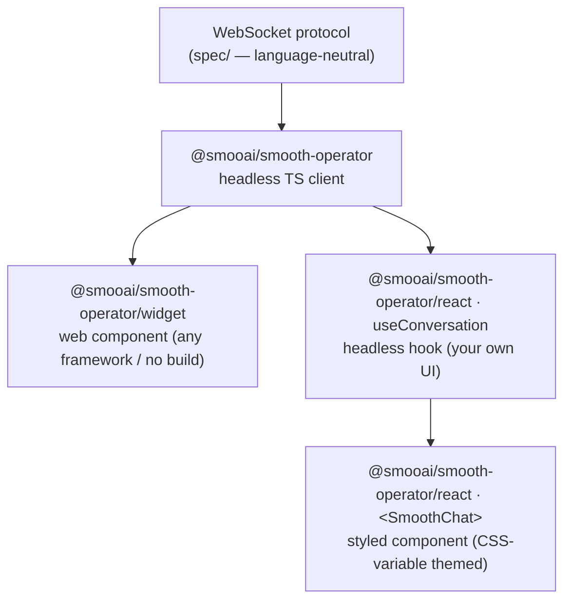

# React Components and Custom UIs

smooth-operator's frontend story is **layered and modular** — you can adopt as
much or as little UI as you want, because every layer sits on the same
schema-driven WebSocket protocol. And it's all **one package**,
`@smooai/smooth-operator`, with subpath exports — install once, import the layer
you need:



| You want…                                              | Import                                       |
| ------------------------------------------------------ | -------------------------------------------- |
| Chat on a page, any framework, maybe no build step     | `@smooai/smooth-operator/widget` (web component) |
| A React app, your own components, full design control  | `@smooai/smooth-operator/react` → `useConversation` |
| A React app, batteries-included chat to theme          | `@smooai/smooth-operator/react` → `<SmoothChat>`    |
| Another language, or a totally custom surface          | the [[Using the Polyglot Clients\|clients]] directly |

One install gives you all of it:

```bash
pnpm add @smooai/smooth-operator react react-dom
```

`react` / `react-dom` are **optional** peer deps — only needed if you import the
`./react` subpath. A client-only or widget-only consumer never pulls React into
their bundle (subpath exports + `sideEffects` keep it tree-shaken out).

## Headless first — `useConversation`

The hook owns the whole lifecycle (connect → create session → stream tokens →
finalize with citations) and returns **only state + actions** — no markup, no
styling. This is the modular core: build any UI on top.

```tsx
import { useConversation } from '@smooai/smooth-operator/react';

function Chat({ url, agentId }: { url: string; agentId: string }) {
    const { status, messages, send } = useConversation({ url, agentId });
    // messages: { id, role, text, streaming, citations? }[]
    // text grows as stream_token events arrive; citations attach on the terminal event.
    return /* render however you like */;
}
```

Returns `{ status, messages, error, sessionId, connect, send, disconnect }`.
Pair it with the exported parts (`MessageList`, `MessageBubble`, `Composer`,
`Citations`, `ConnectionStatusLabel`) or render the state yourself.

## Batteries-included — `<SmoothChat>`

```tsx
import { SmoothChat } from '@smooai/smooth-operator/react';
import '@smooai/smooth-operator/react/styles.css'; // once, anywhere

<SmoothChat url="wss://your-host/ws" agentId={agentId} agentName="Support" greeting="How can I help?" />;
```

## No-React option — the web-component widget

If you're not on React (or want a no-build `<script>` embed), the same UI ships
as a framework-agnostic custom element on the `./widget` subpath:

```ts
import { mountChatWidget } from '@smooai/smooth-operator/widget';
mountChatWidget({ endpoint: 'wss://your-host/ws', agentId });
```

Or drop the standalone IIFE on any page — no bundler, no framework:

```html
<script src="https://unpkg.com/@smooai/smooth-operator/dist/widget/chat-widget.iife.js"></script>
<smooth-agent-chat endpoint="wss://your-host/ws" agent-id="…"></smooth-agent-chat>
```

The widget is themed with the same palette keys (`ChatWidgetTheme`) as the React
components, so a brand ports between them unchanged.

## Theming with CSS variables (not a build coupling)

The deliberate choice here: **components are themed by `--smooth-*` CSS custom
properties**, *not* by a shared Tailwind config. Shipping compiled components
that you "theme through tailwind config" doesn't actually work — a consumer's
`tailwind.config` can't reach class names baked into `node_modules`. CSS
variables travel cleanly regardless of whether you even use Tailwind, and they
compose with `theme()`, `@layer`, design tokens, and `prefers-color-scheme`.

Defaults are declared on the `.smooth-chat` root (never `:root`, so nothing
leaks into your page). Override them three ways, later wins:

1. **Your CSS / Tailwind** — `.smooth-chat { --smooth-color-primary: theme(colors.indigo.600); }`
2. **A `theme` prop** — `<SmoothChat theme={{ primary: '#4f46e5', radius: '16px' }} />` (sets the vars inline; wins over stylesheet rules). `themeToStyle(theme)` is exported for headless use.
3. **Restyle `.smooth-chat__*`** classes outright.

The variable ↔ `theme`-key table is in the package
[README](../../typescript/README.md). Keys match the widget's `ChatWidgetTheme`, so a
brand palette ports between the web-component widget and the React components
unchanged.

## Auth

Pass `authToken` to either `<SmoothChat>` or `useConversation` for BYO-auth — it
rides the WS URL as `?token=…` into the server's `Principal` / `AccessContext`.
See [[Integrating into an Existing App]] and [[Access Control]].

## Related

- [[Using the Polyglot Clients]] — driving the protocol from TS/Go/.NET/Python.
- [[Integrating into an Existing App]] — auth modes for embedding.
- [[Protocol Reference]] — the message/frame contract underneath all of this.
