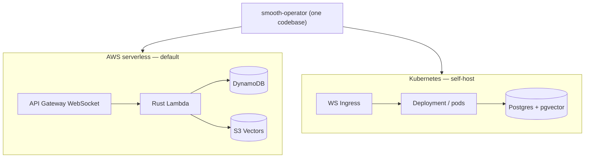

# Self-Hosting

Run smooth-operator on your own infrastructure. There are **two first-class deploy
paths from one codebase** — AWS serverless (default) and Kubernetes — with the
[[Storage Adapters|StorageAdapter]] as the seam that makes the same agent code run
on either. The full design is in [[Deploy Architecture]]; this is the operator's
how-to.



## Choose a backend

| | AWS serverless | Kubernetes |
| --- | --- | --- |
| `SMOOTH_AGENT_STORAGE` | `dynamodb` | `postgres` |
| OLTP | DynamoDB (single table) | Postgres |
| Vectors | S3 Vectors | pgvector (HNSW) |
| Checkpoints | DynamoDB | Postgres |
| Compute | Lambda | Deployment/pods |
| IaC | SST (`deploy/sst`) | Helm + ArgoCD (`deploy/k8s`) |

Both implement the same trait and pass the **same testcontainers conformance
suite**, so "works on Postgres" and "works on DynamoDB" are CI-verified. See
[[Storage Adapters]].

## AWS serverless (SST)

```bash
# Build the Rust Lambda, then deploy with SST.
cd rust && cargo lambda build --release -p smooai-smooth-operator-lambda
cd ../deploy/sst && pnpm install && npx sst deploy --stage prod
```

This stands up the API Gateway WebSocket API + the route Lambda handlers
(`$connect`, `$disconnect`, `send_message`, `ping`, `$default`) + the DynamoDB
single table + the S3 blob bucket + S3 Vectors wiring + the gateway-key secret +
IAM links. The reusable pieces live in the shared
[`@smooai/deploy`](https://github.com/SmooAI/deploy) package (`SmoothAgentApi`).

## Kubernetes (Helm + ArgoCD)

```bash
helm install smooth-operator deploy/k8s --set image.tag=$(git rev-parse --short HEAD)
```

The chart ships the service + WS ingress + hpa + configmap/secret + an ArgoCD
`Application`. It expects an **external pgvector Postgres**. The server binds
`0.0.0.0` via `SMOOTH_AGENT_BIND` in the chart so the Service/Ingress can reach the
pod.

## Set the runtime config

At minimum: the gateway, the storage backend + connection, and an **auth mode**
(don't ship `AUTH_MODE=none`). Full table: [[Configuration]].

```bash
export SMOOAI_GATEWAY_KEY=sk-…
export SMOOTH_AGENT_STORAGE=postgres          # or dynamodb
export SMOOTH_AGENT_DATABASE_URL=postgres://… # postgres path
export AUTH_MODE=jwt                           # BYO IdP — see below
export AUTH_JWT_RS256_PUBLIC_KEY="$(cat idp-public.pem)"
```

> **Secure-by-default.** `jwt`/`smoo` with no key **refuses to start**. Pick `jwt`
> (your IdP) or `smoo` (hosted Smoo identity); wire identity per
> [[Authentication and RBAC]] and [[Integrating into an Existing App]].

## Observability

Point at an OTLP **gRPC** collector to ship `gen_ai.*` spans; unset = local logging
only. See [[Observability]].

```bash
export OTEL_EXPORTER_OTLP_ENDPOINT="http://collector:4317"
```

## The management console

The Next.js [`console/`](../../console/README.md) admin UI consumes the
[[Admin API]] (connector config, document sets, chat history, indexing, settings)
with the same JWT + RBAC. It deploys as an `sst.aws.Nextjs` (OpenNext → Lambda).

## Related

- [[Deploy Architecture]] — the full matrix + the shared `SmooAI/deploy` package.
- [[Storage Adapters]] — the backend designs.
- [[Configuration]] — every env var.
- [[Authentication and RBAC]] · [[Access Control]] — securing it.
