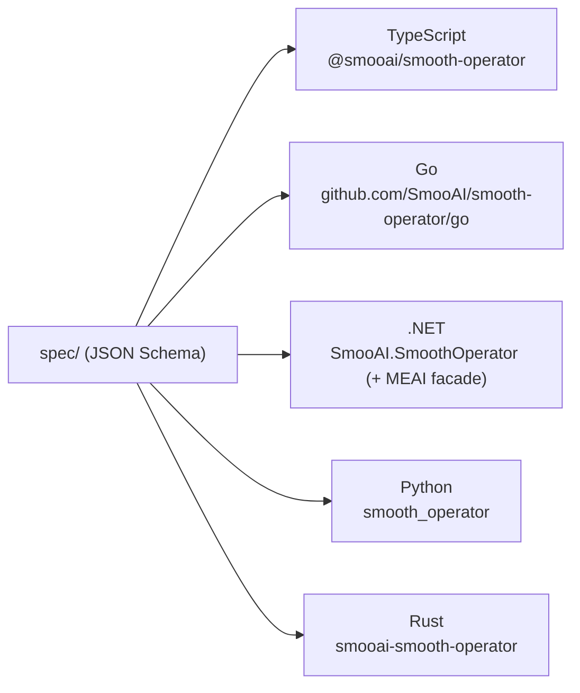

# Using the Polyglot Clients

The same agent turn, from five languages. Every client is generated from the same
[[The Protocol|protocol]] spec ([`spec/`](../../spec)) and validates the shared
conformance fixtures, so they behave identically. Each exposes a transport-agnostic
native client with `requestId` correlation and a streaming **`MessageTurn`** that
is *both* an async iterable of events **and** awaitable for the terminal
`eventual_response`.



All point at the same endpoint — `ws://127.0.0.1:8787/ws` locally (see
[[Getting Started]]), or your hosted/self-hosted server.

## TypeScript — [`typescript/`](../../typescript/README.md)

Lambda-native, ESM, transport-injectable. The one the smooai monorepo dogfoods.

```ts
import { SmoothAgentClient } from '@smooai/smooth-operator';
const client = new SmoothAgentClient({ url: 'ws://127.0.0.1:8787/ws' });
await client.connect();
const session = await client.createConversationSession({ agentId, userName: 'Alice' });
const turn = client.sendMessage({ sessionId: session.sessionId, message: 'How long is your return window?' });
for await (const ev of turn) if (ev.type === 'stream_token') process.stdout.write(ev.token ?? '');
const final = await turn; // EventualResponse
```

## Go — [`go/`](../../go/README.md)

Typed `As*` event accessors; a range-able + awaitable `MessageTurn`.

```go
c, _ := protocol.New(protocol.Options{
    Transport: protocol.NewWebSocketTransport("ws://127.0.0.1:8787/ws", nil),
})
_ = c.Connect(ctx); defer c.Close()
sess, _ := c.CreateConversationSession(ctx, protocol.CreateConversationSessionParams{ /* … */ })
// drive a turn off sess …
```

## .NET — [`dotnet/`](../../dotnet/README.md)

`net8.0`, generated types, streaming `IAsyncEnumerable<ServerEvent>`. Its headline
feature is the **Microsoft.Extensions.AI `IChatClient` facade** — smooth-operator
slots into any Microsoft Agent Framework / Semantic Kernel / MEAI app. See [[.NET MEAI]].

```csharp
await using var client = new SmoothAgentClient(new SmoothAgentClientOptions { Url = "ws://127.0.0.1:8787/ws" });
await client.ConnectAsync();
var session = await client.CreateConversationSessionAsync(new CreateConversationSessionAction { AgentId = agentId, UserName = "Alice" });
var turn = client.SendMessageAsync(new SendMessageAction { SessionId = session.SessionId, Message = "How long is your return window?" });
```

## Python — [`python/`](../../python/README.md)

Async, pydantic v2 discriminated unions; you work in snake_case (the wire is
camelCase).

```python
from smooth_operator import SmoothAgentClient
client = SmoothAgentClient(url="ws://127.0.0.1:8787/ws")
await client.connect()
session = await client.create_conversation_session(agent_id=agent_id, user_name="Alice")
turn = client.send_message(session_id=session.session_id, message="How long is your return window?")
final = await turn
```

## Rust — [`rust/`](../../rust/README.md)

The reference workspace is *also* a library: embed `smooth_operator` to run a
knowledge-grounded turn **in-process** (no network hop to the engine) via
`KnowledgeChatRuntime`. See [[Architecture Overview]] and the
[Rust README](../../rust/README.md).

## HITL across all clients

When a tool needs approval, the turn emits `write_confirmation_required`; answer it
(`confirmToolAction` / `ConfirmTool…` / `confirm_tool_action`) and the **resumed
stream flows back into the same turn handle**. The OTP variant works the same way.
See [[Agents, Tools, and Workflows]] and [[Protocol Reference]].

## Notes

- Until packages are published, depend on a sibling checkout (workspace / `file:` /
  local project ref) — each README has the exact form.
- The `/ws` path matters: the reference server routes the WebSocket there.

## Related

- [[The Protocol]] · [[Protocol Reference]] — the contract the clients implement.
- [[Getting Started]] — boot a server to point them at.
- [[.NET MEAI]] — the MEAI `IChatClient` facade.
