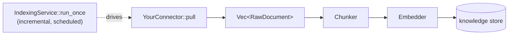

# Writing a Connector

A **connector** is a pluggable knowledge source: it pulls documents, and the
[[Ingestion Pipeline|ingestion pipeline]] chunks, embeds, and stores them so the
agent can retrieve them. This guide is the authoring recipe; the deep pipeline
docs are [[Ingestion Pipeline]] and the GitHub reference is [[Connectors]].

## The `Connector` trait

```rust
#[async_trait]
pub trait Connector: Send + Sync {
    fn name(&self) -> &str;
    async fn pull(&self, since: Option<Timestamp>) -> Result<Vec<RawDocument>>;
}
```

`pull` returns `RawDocument`s — the normalized payload every connector emits:

| field | meaning |
| --- | --- |
| `id` | connector-stable identity (file path, URL, record id) — the **dedup key** |
| `source` | origin label or URL — for HTTP sources a URL (becomes a [[Citations|citation `url`]]); else a label (`"file"`, `"web"`, …) |
| `title` | optional human title (folded into chunk metadata) |
| `content` | textual content (HTML already stripped for the web case) |
| `metadata` | arbitrary source metadata, propagated onto every chunk |
| `acl` | optional access-control labels → stamped into the doc's `DocAcl` and enforced at read ([[Access Control]]) |

Return a **stable `id`** for the same logical document so re-ingests skip unchanged
content.

## Where a connector sits



The built-in connectors you can copy from: `MockConnector` (fixture), `FileConnector`,
`WebConnector` (with an SSRF guard + HTML stripper reused from the `fetch_url`
tool), and `GithubConnector` (prose + code + issues). See [[Ingestion Pipeline]]
for each.

## The recipe

1. **Define a struct** holding whatever it needs (a base URL, an API client, creds).
2. **`impl Connector`**: `name()` returns a short label; `pull(since)` returns
   `Vec<RawDocument>` (honor `since` if the source supports incremental sync,
   otherwise ignore it — the `(id, hash)` dedup keeps full re-pulls cheap).
3. **Give each document a stable `id`** so re-ingests dedupe.
4. **Tests follow the G9 split** (see [[Feature Gaps]]):
   - a **`unit`** test against fixture data — no creds, no network — runs every PR.
     For HTTP connectors, factor the parse/transform into a pure function and test
     it offline (e.g. `WebConnector::body_to_doc`), or stand up a mock server with
     `wiremock` (as the GitHub connector does).
   - an **`external` / live** test that touches the real source, marked
     `#[ignore]` and gated on `SMOOTH_AGENT_E2E=1`, so credential-free CI skips it
     and nightly runs it.

## Stamping ACLs and curation

If your source has permissions, set `RawDocument.acl` — the pipeline writes it as a
`DocAcl` (group entitlements) that [[Access Control|ACL-filtered retrieval]]
enforces at read. To tag a whole source into a scoped [[Document Sets|document set]]
or boost it, use `IngestOptions::in_document_sets([…])` / `.with_boost(…)`.

## Running it through the pipeline

```rust
let report = ingest(
    &your_connector,
    &Chunker::default(),
    &DeterministicEmbedder::new(),   // or a GatewayEmbedder
    storage.knowledge(),
    IngestOptions::for_org("org-acme").with_ledger(ledger),
).await?;
```

For scheduled, incremental pulls, drive it with `IndexingService::run_once` —
see [[Indexing]].

## Related

- [[Ingestion Pipeline]] — the full pull → chunk → embed → store contract + the built-in connectors.
- [[Connectors]] — the GitHub connector + `github_search` reference.
- [[Indexing]] — running a connector on a schedule, incrementally.
- [[Access Control]] · [[Document Sets]] — stamping permissions + curation.
