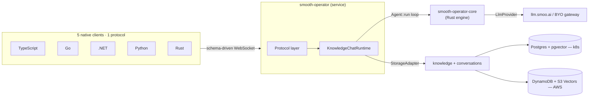

  

# smooth-operator — Documentation Home

> **This `docs/` folder is an [Obsidian](https://obsidian.md) vault.** Open the
> `docs/` directory as a vault to navigate by wikilinks (double-bracketed page
> names); every page also
> renders on GitHub. This page is the **Map of Content (MOC)** — the front door
> to the whole system. New here? Read [[Overview]], then [[Getting Started]].

smooth-operator is part of the [Smoo AI](https://smoo.ai) platform — AI built into every product.

**smooth-operator** is an open-source, serverless-native, **polyglot AI agent
service**: knowledge chat, tool-calling, and multi-participant conversations over
**one schema-driven WebSocket protocol** that five languages — TypeScript, Go,
C#/.NET, Python, and Rust — implement natively. It gives you hybrid retrieval
(dense + sparse + rerank) with structured citations, durable agent checkpoints,
human-in-the-loop approvals, and document-level access control — deployed with one
command to **AWS serverless** *or* **Kubernetes**.

It is the **service layer**. The agent orchestration **engine** is a separate
crate, [`smooai-smooth-operator-core`](https://crates.io/crates/smooai-smooth-operator-core)
(v0.14.0 on crates.io) — a generic `Agent` / `Workflow` / `Tool` / `LlmProvider`
/ `Memory` / `CheckpointStore` engine. This repo wraps that engine with
conversations, knowledge ingestion + retrieval, the tool catalog, the protocol,
the five clients, and the deploy paths. See [[Engine and Service]] for the split.

---

## The map

### 🧭 Concepts — the mental model

Start here to understand *what it is* and *why it's shaped this way*.

- [[Overview]] — what smooth-operator is, the engine↔service split, the one-protocol-five-clients idea.
- [[Engine and Service]] — the two-repo split: the generic engine vs. this service.
- [[The Protocol]] — why the spine is a schema-driven wire protocol, not FFI.
- [[Agents, Tools, and Workflows]] — how a turn runs: the agent loop, tools, HITL.
- [[Knowledge and RAG]] — hybrid retrieval, embeddings, reranking, citations.
- [[Access Control]] — document-level ACLs over org isolation; the auth modes.
- [[Conversations and Sessions]] — the conversation / participant / session / checkpoint model.

### 🏛 Architecture — the deep design docs

- [[Architecture Overview]] — system design, the agent pipeline, how it consumes the engine.
- [[Polyglot Cores]] — native per-language engine implementations (C# first, learning from Microsoft Agent Framework); the shared parity contract.
- [[Storage Adapters]] — the `StorageAdapter` seam; Postgres and DynamoDB/S3 Vectors designs.
- [[Ingestion Pipeline]] — connectors, chunking, the embedder seam, idempotency.
- [[Indexing]] — background / incremental indexing on a schedule.
- [[Document Sets]] — curation: document sets, boosting, metadata filters.
- [[Reranking]] — the optional cross-encoder rerank stage.
- [[Citations]] — how grounded answers carry their sources.
- [[Deploy Architecture]] — dual SST (AWS serverless) / k8s deploy.

### 🛠 Guides — task-oriented how-tos

- [[Getting Started]] — clone, run the reference server, chat locally.
- [[Self-Hosting]] — run it on your own AWS or Kubernetes.
- [[Integrating into an Existing App]] — BYO-JWT and trusted (proxied) auth, with mint snippets.
- [[Build a Dev-Support Agent]] — the `examples/dev-support` recipe (ingest a repo → chat).
- [[Writing a Connector]] — author a new knowledge source.
- [[Using the Polyglot Clients]] — TS / Go / .NET / Python / Rust.
- [[React Components and Custom UIs]] — headless `useConversation` hook + CSS-variable-themed `<SmoothChat>`.

### 📚 Reference — the lookup material

- [[Protocol Reference]] — actions, events, the `AgentEvent` mapping, connection state.
- [[Admin API]] — the auth-gated `/admin/*` HTTP API.
- [[Connectors]] — the GitHub connector + `github_search` tool reference.
- [[Tools]] — the built-in tool catalog + authoring your own.
- [[Configuration]] — every env var / config key in one place.
- [[.NET MEAI]] — the Microsoft.Extensions.AI `IChatClient` facade.

### ⚙️ Operations — running it

- [[Access Control]] — auth model, the three `AUTH_MODE`s, document ACL enforcement.
- [[Evals]] — the LLM-as-judge quality harness.
- [[Observability]] — OpenTelemetry `gen_ai.*` tracing.
- [[Authentication and RBAC]] — roles, principals, the verifier seam.

### 🗺 Planning

- [[Roadmap]] — the phased build plan + current status.
- [[Feature Gaps]] — the TDD gap analysis driving the build.

---

## At a glance

See [[Overview]] for the narrative, [[Architecture Overview]] for the full design.

---

## Outside the vault

- Root [`README.md`](../README.md) — the project landing page + quickstart.
- Per-language clients: [`typescript/`](../typescript/README.md) ·
  [`go/`](../go/README.md) · [`dotnet/`](../dotnet/README.md) ·
  [`python/`](../python/README.md) · [`rust/`](../rust/README.md).
- [`console/`](../console/README.md) — the Next.js management console.
- [`rust/examples/dev-support/`](../rust/examples/dev-support/README.md) — the showcase agent.
- [`spec/`](../spec) — the language-neutral wire protocol (JSON Schema).

---

  Built by <a href="https://smoo.ai"><strong>Smoo AI</strong></a> — AI built into every product.

