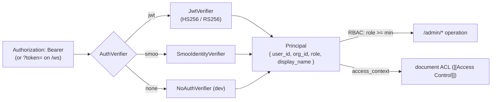

# Authentication and RBAC

How smooth-operator authenticates a request and decides **which operations** it
may perform. This is the operator's view of the auth model; the **document-level**
side (which *documents* a retrieval returns) is [[Access Control]], and the env
vars are in [[Configuration]].

> Two questions, two layers. **RBAC** (this page) gates *which admin operations*
> a principal may run. **Document ACL** ([[Access Control]]) gates *which
> documents* a retrieval returns. The same `Principal` drives both —
> `Principal::access_context()` maps it to the document-level `AccessContext`.

## Role · Principal · AuthVerifier

**Role** is a total order so a route can gate on a minimum: `Admin >= Curator >= Basic`.

| Role | Meaning |
| --- | --- |
| **Admin** | Full org-wide read + all writes/config. |
| **Curator** | Org-wide read of chat history + curation surfaces (indexing, document sets, settings). |
| **Basic** | An end user — may see only their **own** conversations. |

**Principal** is the authenticated identity (`user_id` ← JWT `sub`, `org_id` ←
`org`/`org_id`, `role`, `display_name` ← `name`). Everything the [[Admin API]]
reads is scoped to `org_id`.

**AuthVerifier** is the one seam (`verify(bearer) -> Principal`). Three impls cover
the deployment shapes — plus a fourth tokenless **`trusted`** mode handled at the
transport layer:

| Mode (`AUTH_MODE`) | Verifier | Path |
| --- | --- | --- |
| `jwt` | `JwtVerifier` | **BYO** — validate a JWT from your own IdP (SST OpenAuth recommended; any OIDC works). HS256 or RS256. |
| `smoo` | `SmooIdentityVerifier` | **Hosted** — validate a Smoo-issued JWT (`lom.smoo.ai`). |
| `none` | `NoAuthVerifier` | **Dev only** — fixed `Admin` principal; reachable only via explicit `AUTH_MODE=none`. |
| `trusted` | *(transport)* | **Proxied** — an upstream that already authenticated the user forwards a `base64url(JSON)` identity; trusted without signature/`exp`. See [[Integrating into an Existing App]]. |

## Secure-by-default

The default is `jwt`, and `jwt`/`smoo` with **no key configured** is a hard
`AuthError::Misconfigured` — the server **refuses to start** rather than silently
falling back to no-auth. `none` and `trusted` are only ever reached by an explicit
opt-in; `trusted` emits a loud startup warning. So no-auth can never be the silent
production default.

## RBAC on the admin API

Admin routes are gated by the `RequireRole<MIN>` extractor (`0 = Basic`,
`1 = Curator`, `2 = Admin`), which verifies the bearer and rejects with 401/403
**before** the handler runs. Reads of curation surfaces are Curator; mutations
(connector CRUD, settings) are Admin; everything is org-scoped (a cross-org id is a
**404**, never 403 — existence isn't leaked across orgs). "Basic sees own" filters
a Basic caller to conversations they own. Full endpoint table + the `auth_ref`
secret model: [[Admin API]].

## Related

- [[Access Control]] — the document-level ACL layer RBAC sits on top of, the JWT `groups` contract, and `AUTH_MODE=trusted`.
- [[Admin API]] — the endpoints, role gates, and org-scoping.
- [[Configuration]] — the `AUTH_*` env vars.
- [[Integrating into an Existing App]] — BYO-JWT vs. trusted-proxy, with mint snippets.
