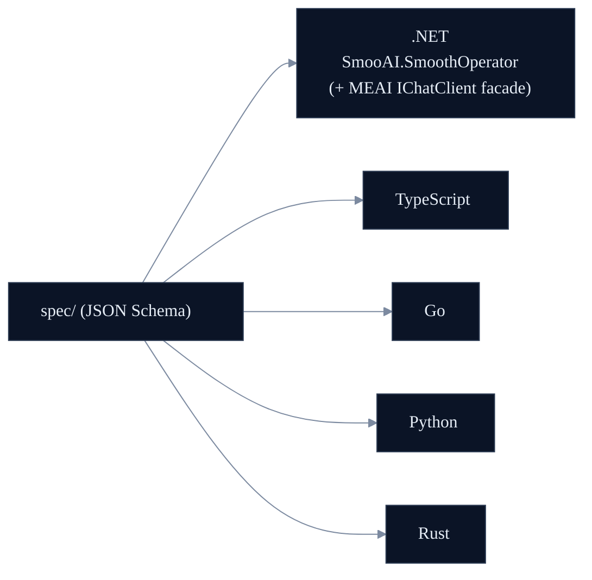
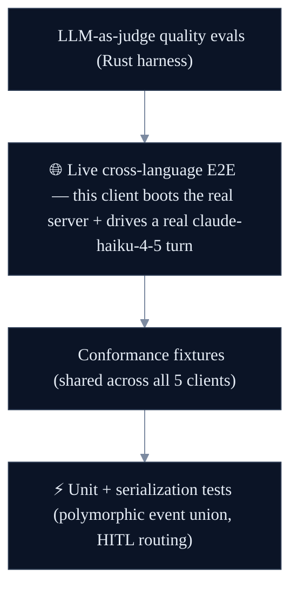

<p align="center"></p>

<p align="center"><strong><code>SmooAI.SmoothOperator</code></strong> — the native .NET client for the smooth-operator protocol, with a first-class <strong>Microsoft.Extensions.AI <code>IChatClient</code> facade</strong>.</p>

<p align="center">
  <a href="../LICENSE"></a>
  
  
  <a href="https://lom.smoo.ai"></a>
</p>

---

## What is this?

The **native C#/.NET client** for the [smooth-operator](../docs/PROTOCOL.md) WebSocket protocol — `net8.0`, with generated-from-spec types and a streaming `MessageTurn`. Its headline feature is the **Microsoft.Extensions.AI (MEAI) `IChatClient` facade**: smooth-operator slots into any **Microsoft Agent Framework**, Semantic Kernel, or MEAI app, and a .NET dev's existing `AIFunction` tools work against it — provider-agnostic, no Azure/Foundry coupling. See [`docs/DOTNET.md`](../docs/DOTNET.md) for the full interop design.

> Types are **generated** from the language-neutral JSON Schemas in [`../spec`](../spec) with [NJsonSchema](https://github.com/RicoSuter/NJsonSchema) (and committed). The ergonomic layer is discriminated unions over System.Text.Json polymorphism.

---

## 30-second quickstart

```bash
dotnet add package SmooAI.SmoothOperator   # NuGet publish pending — local project ref today
```

```csharp
using SmooAI.SmoothOperator;

await using var client = new SmoothAgentClient(new SmoothAgentClientOptions
{
    Url = "ws://127.0.0.1:8787/ws",
});
await client.ConnectAsync();

var session = await client.CreateConversationSessionAsync(
    new CreateConversationSessionAction { AgentId = agentId, UserName = "Alice" });

var turn = client.SendMessageAsync(new SendMessageAction
{
    SessionId = session.SessionId,
    Message = "How long is your return window?",
});

EventualResponseEvent final = await turn.Completion;
Console.WriteLine(final.Data.Payload.MessageId);
```

(Point `Url` at your own [`smooth-operator-server`](../rust/README.md) or the hosted endpoint.)

---

## Watch it stream

`SendMessageAsync` returns a `MessageTurn` you can `await foreach` for live events **and** `await turn.Completion` for the authoritative terminal response.

```csharp
var turn = client.SendMessageAsync(new SendMessageAction
{
    SessionId = session.SessionId,
    Message = "Where is my order?",
    Stream = true,
});

await foreach (var ev in turn)
{
    if (ev is StreamChunkEvent chunk) Console.Error.WriteLine($"  ↳ node: {chunk.Node}");
    if (ev is StreamTokenEvent t)     Console.Write(t.Token);   // tokens, live
    if (ev is WriteConfirmationRequiredEvent)
        // HITL: approve, and the resumed stream flows back into this same turn.
        await client.ConfirmToolActionAsync(session.SessionId, turn.RequestId, approved: true);
}

EventualResponseEvent final = await turn.Completion;
Console.WriteLine($"\nmessageId: {final.Data.Payload.MessageId}");
```

---

## The Microsoft.Extensions.AI `IChatClient` facade

This is the .NET highlight. Wrap the remote `SmoothAgentClient` in a `SmoothAgentChatClient : IChatClient` and register it with DI — then smooth-operator behaves like any other MEAI chat client, including streaming.

```csharp
using Microsoft.Extensions.AI;
using SmooAI.SmoothOperator;

// DI registration — IServiceCollection extension.
services.AddSmoothAgent(options => options.Url = "ws://127.0.0.1:8787/ws");

// Resolve and use it as a standard MEAI IChatClient.
IChatClient chat = serviceProvider.GetRequiredService<IChatClient>();

await foreach (var update in chat.GetStreamingResponseAsync("How long is your return window?"))
    Console.Write(update.Text);
```

Why this matters:

- **Drop-in for the .NET AI ecosystem.** MEAI's `IChatClient` is the de-facto standard; the Microsoft Agent Framework and Semantic Kernel build on it. The facade lets smooth-operator slot into any of them.
- **Your existing tools work.** `AIFunction` / `AIFunctionFactory.Create()` tools a .NET dev already wrote run against smooth-operator — no bespoke C# `ToolDefinition` DSL.
- **A session handle, not id plumbing.** `SmoothAgentThread` wraps `sessionId`/`threadId` so multi-turn is `thread.RunStreamingAsync(msg)`.
- **Middleware maps to engine hooks.** ASP.NET-style delegating handlers (pre/post run, pre/post tool) map onto smooth-operator's `ToolHook` / `ConfirmationHook`.
- **Provider-agnostic.** No Azure/Foundry coupling — the agent runs behind the WS protocol; the facade is a thin skin over the remote client.

> **Shipped & tested** (27 passing, incl. 6 MEAI interop tests over a mock transport): the generated protocol client (streaming `IAsyncEnumerable<ServerEvent>` + HITL), the `SmoothAgentChatClient : IChatClient` facade, `AddSmoothAgent(...)` DI, and `SmoothAgentThread`. Full design + borrow-list in [`docs/DOTNET.md`](../docs/DOTNET.md).

---

## Polyglot — one spec, five clients



---

## Test-driven by default

> **Nothing here is vibe-coded — it's verified against a real LLM gateway.**



**27 tests** — conformance, client, and serialization. The live cross-language E2E boots a real `smooth-operator-server` subprocess (KB seeded) and drives a real `claude-haiku-4-5` turn over WebSocket: ≥1 streamed event, a knowledge-grounded "17", per-session memory.

**A real bug the live E2E caught (mocks masked it):** `[JsonPolymorphic]` required the `type` discriminator first, but the Rust server emits JSON keys alphabetically — so deserialization failed against the real server. The fix is a position-independent `ServerEventConverter`. A mock that emitted keys in declaration order would never have surfaced it.

**The proof story:** an LLM-as-judge scored a multi-turn answer **1/5** (the runtime forgot turn 1's context); the failing eval drove a per-session-memory fix; **it now scores 5/5** — a regression a substring test would have missed. See [`docs/EVALS.md`](../docs/EVALS.md).

Live tests are **gated, never silently skipped** — `SMOOTH_AGENT_E2E=1` + `SMOOAI_GATEWAY_KEY` to run; skip cleanly otherwise.

```bash
dotnet test SmooAI.SmoothOperator.slnx
```

## Regenerating types

After a schema change in `../spec`:

```bash
dotnet run --project tools/Generator
```

## Smoo-powered or bring-your-own

Point `Url` at the hosted **[lom.smoo.ai](https://lom.smoo.ai)** endpoint, or at your own self-hosted `smooth-operator-server` — same protocol, same client, same MEAI facade.

## License

MIT © 2026 Smoo AI
