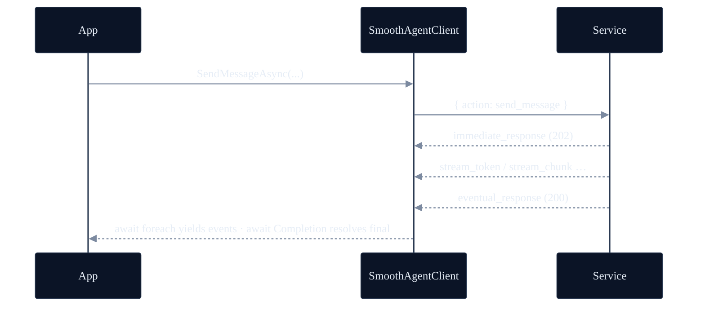
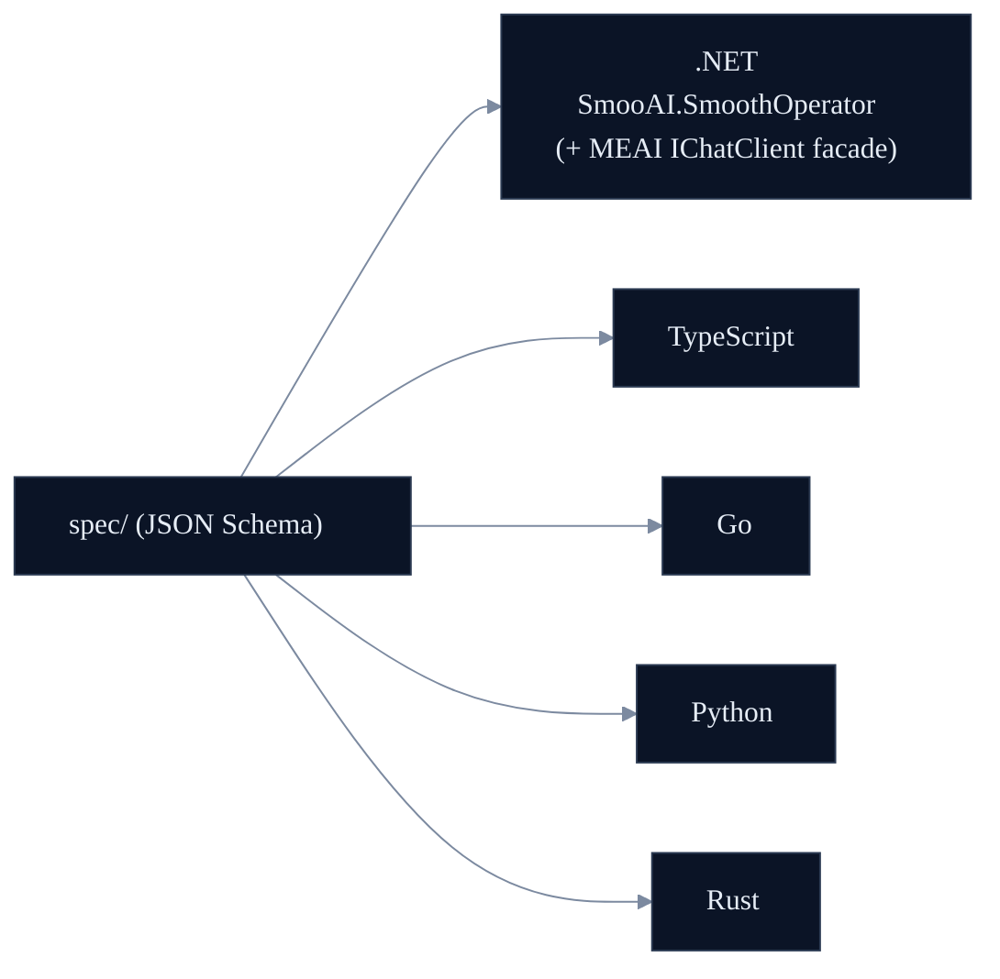

<p align="center">
  <a href="https://smoo.ai"></a>
</p>

<p align="center">
  <a href="https://smoo.ai"></a>
  <a href="https://github.com/SmooAI/smooth-operator/blob/main/LICENSE"></a>
  <a href="https://lom.smoo.ai"></a>
  <a href="https://www.nuget.org/packages/SmooAI.SmoothOperator"></a>
  <a href="https://dotnet.microsoft.com"></a>
</p>

<p align="center">
  <b><code>SmooAI.SmoothOperator</code></b> — the native .NET client for the <a href="https://github.com/SmooAI/smooth-operator">smooth-operator</a> service, with a first-class <a href="https://learn.microsoft.com/dotnet/ai/microsoft-extensions-ai"><code>Microsoft.Extensions.AI</code></a> <code>IChatClient</code> facade.<br/>Streaming agent turns, HITL resume, fully typed. One of <b>five native SDKs</b> over one schema-driven WebSocket protocol.
</p>

---

## What is this?

The **native .NET client** for the [smooth-operator](https://github.com/SmooAI/smooth-operator/blob/main/docs/PROTOCOL.md) WebSocket protocol. It connects to a running smooth-operator **service** (create a session, send a message, stream the agent's events back) — not the agent engine itself. The wire types are generated from the language-neutral JSON Schemas in [`spec/`](https://github.com/SmooAI/smooth-operator/tree/main/spec), and the package ships a **`Microsoft.Extensions.AI` (MEAI) `IChatClient` facade** so a .NET host can talk to a remote agent through the standard ecosystem abstraction — DI-first.

---

## Install

```bash
dotnet add package SmooAI.SmoothOperator
```

Targets `net8.0`. Pulls in `Microsoft.Extensions.AI.Abstractions` (the `IChatClient` facade) and `NJsonSchema` (optional runtime validation).

---

## Quickstart

`SendMessageAsync` returns a `MessageTurn` that is **both** an `IAsyncEnumerable<ServerEvent>` you iterate for live events **and** awaitable (via `.Completion`) for the authoritative terminal `eventual_response`.

```csharp
using SmooAI.SmoothOperator;

await using var client = new SmoothAgentClient(new SmoothAgentClientOptions
{
    Url = "ws://127.0.0.1:8787/ws",
});
await client.ConnectAsync();

var session = await client.CreateConversationSessionAsync(new CreateConversationSessionAction
{
    AgentId  = "11111111-1111-1111-1111-111111111111",
    UserName = "Alice",
});

var turn = client.SendMessageAsync(new SendMessageAction
{
    SessionId = session.SessionId,
    Message   = "How long is your return window?",
});

await foreach (var ev in turn)
{
    switch (ev)
    {
        case StreamTokenEvent t:                              // tokens, live
            Console.Write(t.Token);
            break;
        case StreamChunkEvent c:                              // workflow node boundary
            Console.Error.WriteLine($"\n  ↳ node: {c.Node}");
            break;
        case WriteConfirmationRequiredEvent:
            // HITL: a tool wants to write. Approve, and the resumed stream
            // flows back into THIS same turn.
            await client.ConfirmToolActionAsync(session.SessionId, turn.RequestId, approved: true);
            break;
    }
}

var final = await turn.Completion;                            // EventualResponseEvent — the terminal state
Console.WriteLine($"\nmessageId: {final.Data.Payload.MessageId}");
```

(Point `Url` at your own [`smooth-operator-server`](https://github.com/SmooAI/smooth-operator/blob/main/rust/README.md), or at the hosted endpoint.)

---

## The `IChatClient` facade (MEAI)

If your app already speaks `Microsoft.Extensions.AI`, register the agent client and resolve it as an `IChatClient` — the remote agent shows up as just another chat client, streaming `ChatResponseUpdate`s.

```csharp
using Microsoft.Extensions.AI;
using Microsoft.Extensions.DependencyInjection;
using SmooAI.SmoothOperator;

services.AddSmoothAgent(o =>
{
    o.Url     = "ws://127.0.0.1:8787/ws";
    o.AgentId = "11111111-1111-1111-1111-111111111111";
});

// Later, resolved from DI:
var chat = serviceProvider.GetRequiredService<IChatClient>();

await foreach (var update in chat.GetStreamingResponseAsync("How long is your return window?"))
    Console.Write(update.Text);
```

`AddSmoothAgent` registers `SmoothAgentOptions`, the `SmoothAgentClient`, and the `SmoothAgentChatClient` (as `IChatClient`) — all singletons over the configured transport. The client is constructed but **not connected**; call `ConnectAsync` during host startup (or inject an already-open transport, as the tests do).

---

## Streaming, end to end



---

## Transport injection

The client never touches a socket directly — it talks to an injectable `ITransport` (default: a `System.Net.WebSockets` implementation). Inject a mock in tests, which is how the conformance suite exercises real client code (correlation, parsing, HITL routing) without a network.

```csharp
new SmoothAgentClient(new SmoothAgentClientOptions { Transport = myTransport });
```

## Runtime validation (optional)

```csharp
var validator = await ProtocolValidator.LoadAsync();
validator.ValidateEvent(incomingFrame); // NJsonSchema-compiled from the spec schemas
```

---

## Polyglot — one spec, five clients

This is one of five native clients generated from the same protocol — the **`IChatClient` facade is the .NET-ecosystem feature**.



---

## Test-driven by default

> **Nothing here is vibe-coded — it's verified against a real LLM gateway.**

**27 tests.** In the live cross-language E2E, this client boots a real `smooth-operator-server` subprocess (KB seeded) and drives a real `claude-haiku-4-5` turn over WebSocket — asserting ≥1 streamed event, a knowledge-grounded "17", and per-session memory. The `ITransport` seam lets the rest of the suite drive real client code (correlation, event discrimination, HITL routing) with a mock — no network.

**The proof story:** an LLM-as-judge scored a multi-turn answer **1/5** (the runtime forgot turn 1's context); the failing eval drove a per-session-memory fix; **it now scores 5/5** — a regression a substring test would have missed. See [`docs/EVALS.md`](https://github.com/SmooAI/smooth-operator/blob/main/docs/EVALS.md).

Live tests are **gated, never silently skipped** — they run with `SMOOTH_AGENT_E2E=1` + `SMOOAI_GATEWAY_KEY` and skip cleanly otherwise.

---

## Smoo-powered or bring-your-own

Point `Url` at the hosted **[lom.smoo.ai](https://lom.smoo.ai)** endpoint, or at your own self-hosted `smooth-operator-server` (AWS Lambda or k8s) — same protocol, same client.

## 🧩 Part of Smoo AI

`SmooAI.SmoothOperator` is built and open-sourced by **[Smoo AI](https://smoo.ai)** — the AI-powered business platform with AI built into every product. It's the .NET member of the **polyglot SDK set** (TypeScript · Python · Go · .NET · Rust) for the [smooth-operator](https://github.com/SmooAI/smooth-operator) service.

- 🌐 **The service** — [smooth-operator](https://github.com/SmooAI/smooth-operator) (protocol, server, the five clients, AWS/k8s deploy)
- 🧰 **More open source from Smoo AI** — [smoo.ai/open-source](https://smoo.ai/open-source)
- ☁️ **Hosted** — [lom.smoo.ai](https://lom.smoo.ai) runs smooth-operator for you, managed and multi-tenant

## 🔗 Links

- 📦 **NuGet** — [`SmooAI.SmoothOperator`](https://www.nuget.org/packages/SmooAI.SmoothOperator)
- 🛰️ **Protocol** — [`docs/PROTOCOL.md`](https://github.com/SmooAI/smooth-operator/blob/main/docs/PROTOCOL.md)
- 🧪 **Evals** — [`docs/EVALS.md`](https://github.com/SmooAI/smooth-operator/blob/main/docs/EVALS.md)
- 💬 **Issues** — [github.com/SmooAI/smooth-operator/issues](https://github.com/SmooAI/smooth-operator/issues)

## 📄 License

MIT © 2026 Smoo AI. See [LICENSE](https://github.com/SmooAI/smooth-operator/blob/main/LICENSE).

---

<p align="center">
  Built by <a href="https://smoo.ai"><strong>Smoo AI</strong></a> — AI built into every product.
</p>
