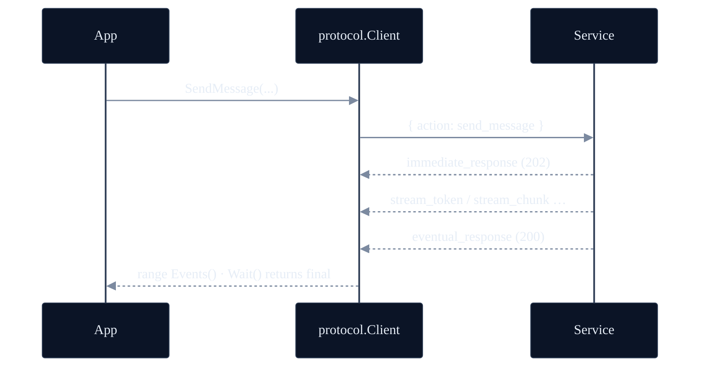
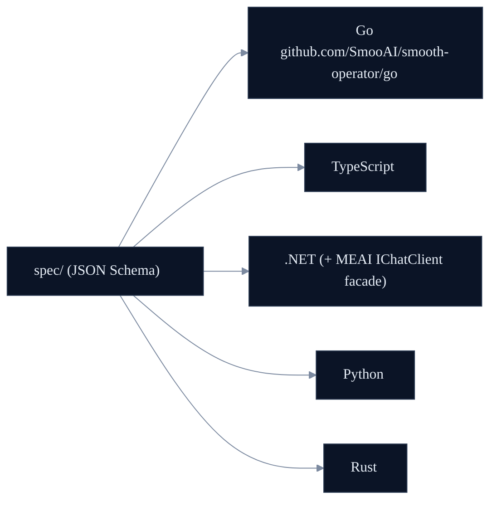
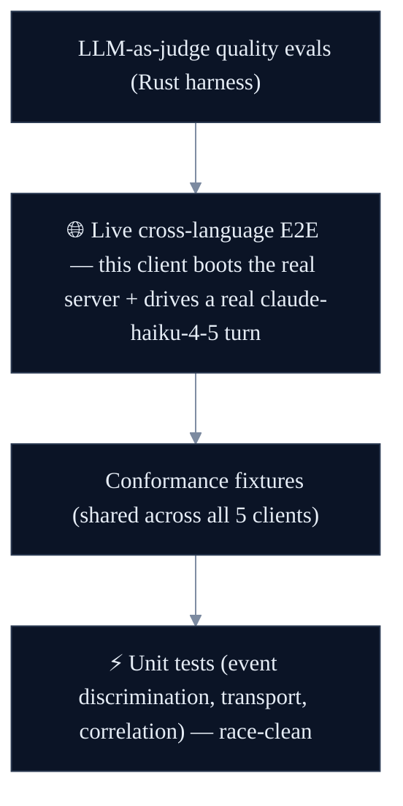

<p align="center">
  <a href="https://smoo.ai"></a>
</p>

<p align="center">
  <a href="https://smoo.ai"></a>
  <a href="https://github.com/SmooAI/smooth-operator/blob/main/LICENSE"></a>
  <a href="https://lom.smoo.ai"></a>
  <a href="https://pkg.go.dev/github.com/SmooAI/smooth-operator/go"></a>
  <a href="https://go.dev"></a>
</p>

<p align="center">
  <b><code>github.com/SmooAI/smooth-operator/go</code></b> — the idiomatic, race-clean Go client for the <a href="https://github.com/SmooAI/smooth-operator">smooth-operator</a> service.<br/>Streaming agent turns, HITL resume, transport-agnostic. One of <b>five native SDKs</b> over one schema-driven WebSocket protocol.
</p>

---

## What is this?

The **native Go client** for the [smooth-operator](https://github.com/SmooAI/smooth-operator/blob/main/docs/PROTOCOL.md) WebSocket protocol. It connects to a running smooth-operator **service** (create a session, send a message, stream the agent's events back) — not the agent engine itself. Wire types are generated from the language-neutral JSON Schemas in [`spec/`](https://github.com/SmooAI/smooth-operator/tree/main/spec) (committed, so you don't need the generator); the ergonomic layer gives you typed `As*` event accessors and a streaming `MessageTurn` that's both range-able and awaitable.

---

## 30-second quickstart

```bash
go get github.com/SmooAI/smooth-operator/go/protocol
```

```go
package main

import (
	"context"
	"fmt"

	"github.com/SmooAI/smooth-operator/go/protocol"
)

func main() {
	ctx := context.Background()

	c, _ := protocol.New(protocol.Options{
		Transport: protocol.NewWebSocketTransport("ws://127.0.0.1:8787/ws", nil),
	})
	_ = c.Connect(ctx)
	defer c.Close()

	sess, _ := c.CreateConversationSession(ctx, protocol.CreateConversationSessionParams{
		AgentID:  "11111111-1111-1111-1111-111111111111",
		UserName: "Alice",
	})

	turn := c.SendMessage(protocol.SendMessageParams{SessionID: sess.SessionID, Message: "How long is your return window?"})
	final, _ := turn.Wait(ctx)
	fmt.Println("messageId:", final.Data.Data.MessageID)
}
```

(Point the transport at your own [`smooth-operator-server`](https://github.com/SmooAI/smooth-operator/blob/main/rust/README.md) or the hosted endpoint.)

---

## Watch it stream

`SendMessage` returns a `MessageTurn` — range over `Events()` for live tokens, then `Wait()` for the authoritative terminal response. Go has no sum types, so a `ServerEvent` carries the common envelope fields plus the raw frame; switch on `Type` and call the matching `As*` accessor.

```go
turn := c.SendMessage(protocol.SendMessageParams{SessionID: sess.SessionID, Message: "Where's my order?"})

for ev := range turn.Events() {
	switch ev.Type {
	case protocol.EventStreamToken:
		tok, _ := ev.AsStreamToken()
		fmt.Print(tok.Data.Token)                 // tokens, live
	case protocol.EventStreamChunk:
		chunk, _ := ev.AsStreamChunk()
		fmt.Printf("\n  ↳ node: %s\n", chunk.Node) // workflow node boundary
	case protocol.EventWriteConfirmationRequired:
		// HITL: approve and the resumed stream flows back into this same turn.
		c.ConfirmToolAction(protocol.ConfirmToolActionParams{
			SessionID: sess.SessionID, RequestID: turn.RequestID(), Approved: true,
		})
	}
}

final, _ := turn.Wait(ctx)
fmt.Println("\nmessageId:", final.Data.Data.MessageID)
```



---

## Layout

| File | Purpose |
| --- | --- |
| `protocol/types_gen.go` | Generated wire types (one struct per schema / `$def`). **Do not edit.** |
| `protocol/events.go` | Ergonomic `ServerEvent` discrimination + typed `As*` accessors. |
| `protocol/transport.go` | `Transport` interface + default `coder/websocket` implementation. |
| `protocol/client.go` | `Client` with the action methods. |
| `protocol/turn.go` | `MessageTurn` (streaming events + awaitable terminal) + `ProtocolError`. |
| `protocol/validate.go` | Optional runtime JSON Schema validation against `../spec/`. |

The `Transport` interface is mockable, so the test suite drives real client code (correlation, event discrimination, HITL routing) without a network.

---

## Polyglot — one spec, five clients



---

## Test-driven by default

> **Nothing here is vibe-coded — it's verified against a real LLM gateway.**



**26 tests, race-clean** (`go test -race`). In the live cross-language E2E ([`e2e_live_test.go`](https://github.com/SmooAI/smooth-operator/blob/main/go/e2e_live_test.go)), this client boots a real `smooth-operator-server` subprocess (KB seeded) and drives a real `claude-haiku-4-5` turn over WebSocket — asserting ≥1 streamed event, a knowledge-grounded "17", and per-session memory.

**The proof story:** an LLM-as-judge scored a multi-turn answer **1/5** (the runtime forgot turn 1's context); the failing eval drove a per-session-memory fix; **it now scores 5/5** — a regression a substring test would have missed. See [`docs/EVALS.md`](https://github.com/SmooAI/smooth-operator/blob/main/docs/EVALS.md).

Live tests are **gated, never silently skipped** — they run with `SMOOTH_AGENT_E2E=1` + `SMOOAI_GATEWAY_KEY` and skip cleanly otherwise.

```bash
go test -race ./...                                   # no creds
SMOOTH_AGENT_E2E=1 go test -race ./... -run Live      # live cross-language E2E
```

## Regenerating types

`protocol/types_gen.go` is generated with [`go-jsonschema`](https://github.com/atombender/go-jsonschema) (pure Go, offline). Run [`scripts/generate-go.sh`](../scripts/generate-go.sh) from the repo root after any `../spec` change:

```bash
go install github.com/atombender/go-jsonschema@latest   # once
./scripts/generate-go.sh
```

The script documents its own flags. The two that matter: `--only-models` (plain structs, no generated enum validation, so the client tolerates forward-compatible wire values and the conformance fixtures round-trip cleanly) and `--struct-name-from-title` (every `$def` in the spec carries a stable title, so feeding all schemas at once doesn't collide on the shared `$defs/Request` / `$defs/Response` keys).

## Smoo-powered or bring-your-own

Point the transport at the hosted **[lom.smoo.ai](https://lom.smoo.ai)** endpoint, or at your own self-hosted `smooth-operator-server` — same protocol, same client.

Authenticating to a token-gated server? Pass a connection `Token` — it rides the `?token=` query slot of the WS URL (browsers can't set WebSocket headers):

```go
c, _ := protocol.New(protocol.Options{
	Transport: protocol.NewWebSocketTransportWithOptions(
		"wss://lom.smoo.ai/ws",
		protocol.WebSocketOptions{Token: connToken},
	),
})
```

## 🧩 Part of Smoo AI

This Go client is built and open-sourced by **[Smoo AI](https://smoo.ai)** — the AI-powered business platform with AI built into every product. It's the Go member of the **polyglot SDK set** (TypeScript · Python · Go · .NET · Rust) for the [smooth-operator](https://github.com/SmooAI/smooth-operator) service.

- 🌐 **The service** — [smooth-operator](https://github.com/SmooAI/smooth-operator) (protocol, server, the five clients, AWS/k8s deploy)
- 🧰 **More open source from Smoo AI** — [smoo.ai/open-source](https://smoo.ai/open-source)
- ☁️ **Hosted** — [lom.smoo.ai](https://lom.smoo.ai) runs smooth-operator for you, managed and multi-tenant

## 🔗 Links

- 📦 **pkg.go.dev** — [`github.com/SmooAI/smooth-operator/go`](https://pkg.go.dev/github.com/SmooAI/smooth-operator/go)
- 🛰️ **Protocol** — [`docs/PROTOCOL.md`](https://github.com/SmooAI/smooth-operator/blob/main/docs/PROTOCOL.md)
- 🧪 **Evals** — [`docs/EVALS.md`](https://github.com/SmooAI/smooth-operator/blob/main/docs/EVALS.md)
- 💬 **Issues** — [github.com/SmooAI/smooth-operator/issues](https://github.com/SmooAI/smooth-operator/issues)

## 📄 License

MIT © 2026 Smoo AI. See [LICENSE](https://github.com/SmooAI/smooth-operator/blob/main/LICENSE).

---

<p align="center">
  Built by <a href="https://smoo.ai"><strong>Smoo AI</strong></a> — AI built into every product.
</p>
