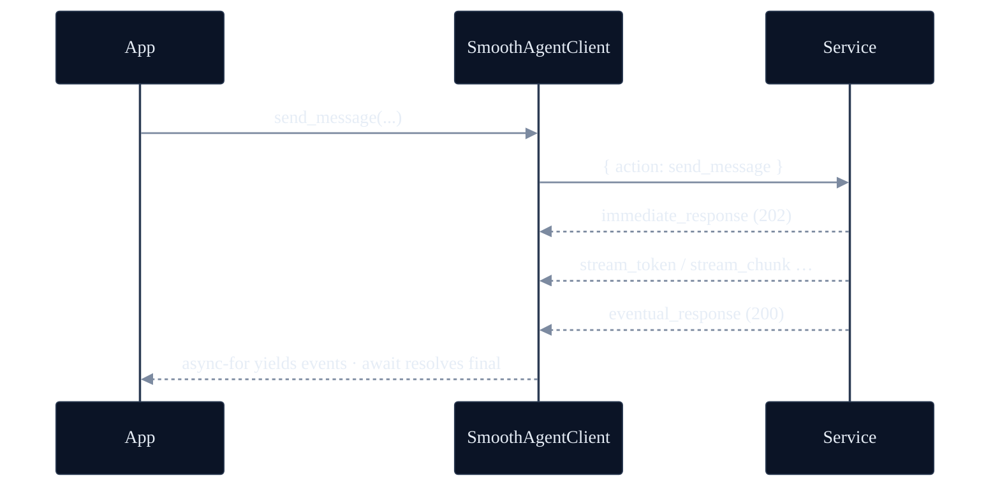
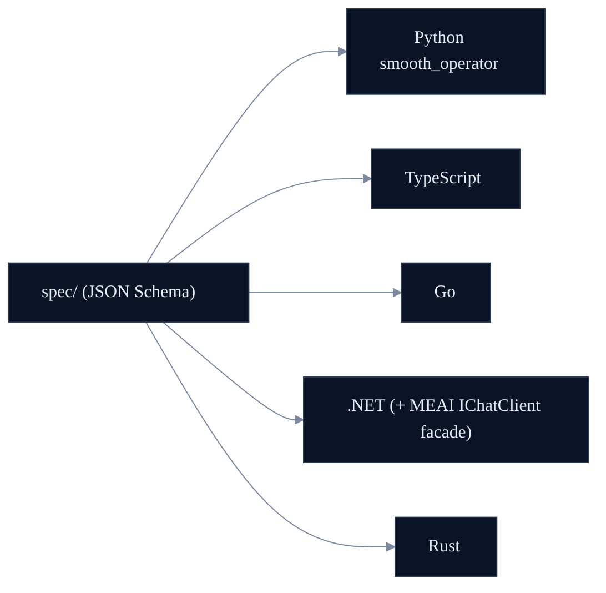
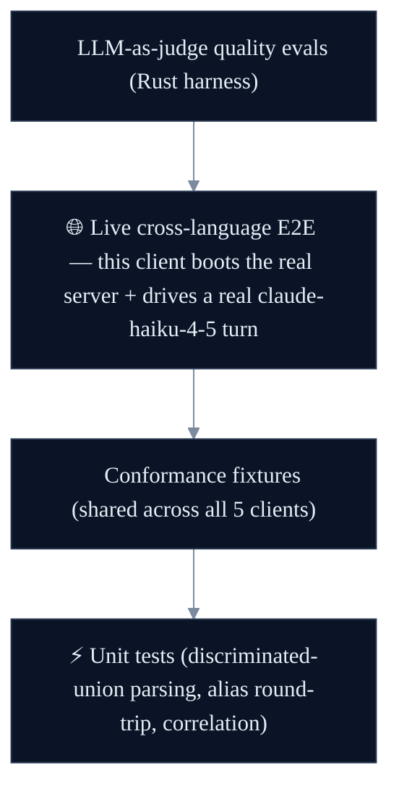

<p align="center"></p>

<p align="center"><strong>smooth-operator — Python client.</strong> A native, fully-async WebSocket client for the smooth-operator protocol, with pydantic v2 models.</p>

<p align="center">
  <a href="../LICENSE"></a>
  
  
  <a href="https://lom.smoo.ai"></a>
</p>

---

## What is this?

The **native async Python client** for the [smooth-operator](../docs/PROTOCOL.md) WebSocket protocol. The pydantic v2 models in `smooth_operator._generated` are generated from the language-neutral JSON Schemas in [`../spec/`](../spec) (and committed), using pydantic discriminated unions so events deserialize to the right concrete type. The wire is camelCase; you work in idiomatic snake_case.

---

## 30-second quickstart

```bash
uv add smooth-operator          # PyPI publish pending — install from the local path today
```

Until this package is published to PyPI, install it from a sibling checkout
(`uv add ../smooth-operator/python`, or `pip install -e path/to/smooth-operator/python`).
The unqualified PyPI name is **not** this package yet — don't `pip install smooth-operator`
from the public index until the SmooAI release lands.

```python
import asyncio
from smooth_operator import SmoothAgentClient

async def main():
    client = SmoothAgentClient(url="ws://127.0.0.1:8787/ws")
    await client.connect()

    session = await client.create_conversation_session(agent_id=agent_id, user_name="Alice")

    turn = client.send_message(session_id=session.session_id, message="How long is your return window?")
    final = await turn                       # the terminal eventual_response
    print(final.data.payload.message_id)

asyncio.run(main())
```

(Point `url` at your own [`smooth-operator-server`](../rust/README.md) or the hosted endpoint.)

---

## Watch it stream

`send_message` returns a turn you can `async for` over for live events **and** `await` for the authoritative terminal response.

```python
turn = client.send_message(session_id=session.session_id, message="Where is my order?")

async for event in turn:
    if event.type == "stream_chunk":
        print(f"\n  ↳ node: {event.node}")          # workflow node boundary
    elif event.type == "stream_token":
        print(event.token, end="", flush=True)       # tokens, live
    elif event.type == "write_confirmation_required":
        # HITL: approve, and the resumed stream flows back into this same turn.
        await client.confirm_tool_action(
            session_id=session.session_id, request_id=turn.request_id, approved=True
        )

final = await turn                                    # the terminal eventual_response
print("\nmessageId:", final.data.payload.message_id)
```



---

## camelCase wire, snake_case Python

The JSON wire form is camelCase (`requestId`, `sessionId`); the pydantic models use snake_case attributes with camelCase aliases and `populate_by_name = True`. So you construct/access with `session.session_id`, and `model_dump(by_alias=True)` emits the camelCase wire form.

---

## Polyglot — one spec, five clients



---

## Test-driven by default

> **Nothing here is vibe-coded — it's verified against a real LLM gateway.**



**26 tests.** The live cross-language E2E boots a real `smooth-operator-server` subprocess (KB seeded) and drives a real `claude-haiku-4-5` turn over WebSocket: ≥1 streamed event, a knowledge-grounded "17", per-session memory.

**A real bug the live E2E caught (mocks masked it):** `agentId` is UUID-typed in `spec/`, so pydantic rejected a bare string the lenient Go/TS clients accepted — surfacing a real cross-client `string`-vs-`UUID` alignment gap. A mock fixture using a valid UUID would have hidden it.

**The proof story:** an LLM-as-judge scored a multi-turn answer **1/5** (the runtime forgot turn 1's context); the failing eval drove a per-session-memory fix; **it now scores 5/5** — a regression a substring test would have missed. See [`docs/EVALS.md`](../docs/EVALS.md).

Live tests are **gated, never silently skipped** — `SMOOTH_AGENT_E2E=1` + `SMOOAI_GATEWAY_KEY` to run; skip cleanly otherwise.

```bash
uv run pytest                                          # no creds
SMOOTH_AGENT_E2E=1 uv run pytest -m e2e                # live cross-language E2E
```

## Develop & regenerate

```bash
uv sync
uv run python -c "import smooth_operator"
uv run python scripts/generate.py    # regen pydantic models from ../spec via datamodel-code-generator
```

## Smoo-powered or bring-your-own

Point `url` at the hosted **[lom.smoo.ai](https://lom.smoo.ai)** endpoint, or at your own self-hosted `smooth-operator-server` — same protocol, same client.

## License

MIT © 2026 Smoo AI
