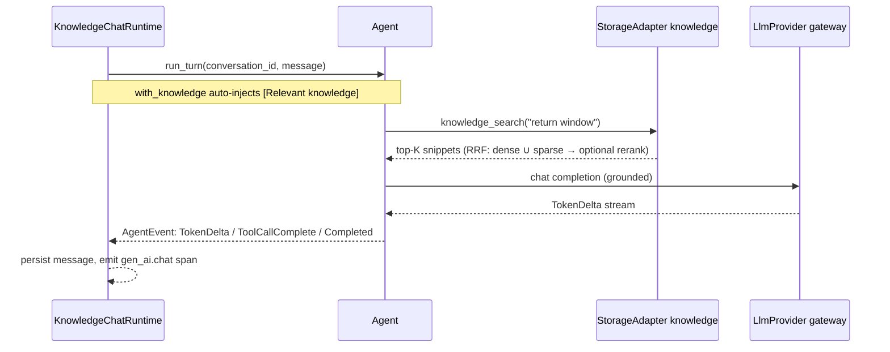
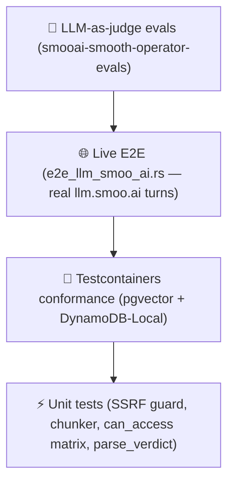

<p align="center"></p>

<p align="center"><strong>The Rust flagship</strong> — the reference smooth-operator service: runtime, storage adapters, WebSocket server, and Lambda, all on the <a href="https://github.com/SmooAI/smooth-operator-core">smooth-operator-core</a> engine.</p>

<p align="center">
  <a href="../LICENSE"></a>
  
  
  <a href="https://lom.smoo.ai"></a>
</p>

---

## What is this?

The Rust workspace is the **reference implementation** of smooth-operator and the source of truth every other client is measured against. It is also a **library**: embed `smooth_operator` in your own Rust service to run a knowledge-grounded agent turn with tool-calling, HITL, and durable checkpoints — in-process, no network hop to the engine.

The flagship crate is **`smooai-smooth-operator`** (lib `smooth_operator`). The workspace also ships the server, the Lambda, the storage adapters, the ingestion pipeline, and the eval harness.

| Crate | What |
| --- | --- |
| `smooai-smooth-operator` (lib `smooth_operator`) | The runtime + `StorageAdapter` seam + built-in tools + telemetry. The library you embed. |
| `smooai-smooth-operator-server` (bin `smooth-operator-server`) | Reference WebSocket service — speaks the protocol over a `KnowledgeChatRuntime`. |
| `smooai-smooth-operator-lambda` | AWS Lambda dispatch (per-message; Management-API post-back preserving streaming). |
| `smooai-smooth-operator-adapter-memory` | In-memory adapter — the conformance baseline. |
| `smooai-smooth-operator-adapter-postgres` | Postgres + `pgvector` (HNSW) + `tsvector` BM25 → RRF. The k8s path. |
| `smooai-smooth-operator-adapter-dynamodb` | DynamoDB single-table + S3 Vectors. The AWS path. |
| `smooai-smooth-operator-ingestion` | Connector → chunker → embedder → knowledge pipeline (idempotent). |
| `smooai-smooth-operator-evals` | LLM-as-judge quality harness. |

---

## 30-second quickstart — embed the runtime

```bash
# crates.io publish pending — use a git or path dependency today, e.g.:
#   smooai-smooth-operator = { git = "https://github.com/SmooAI/smooth-operator" }
cargo add smooai-smooth-operator smooai-smooth-operator-adapter-memory tokio --features tokio/full
```

Build a runtime over any `StorageAdapter`, seed a fact, and run a turn. The runtime auto-injects relevant knowledge **and** exposes a `knowledge_search` tool — the model retrieves and grounds on its own.

```rust
use std::sync::Arc;
use smooth_operator::runtime::KnowledgeChatRuntime;
use smooth_operator::adapter::StorageAdapter;
use smooai_smooth_operator_adapter_memory::InMemoryAdapter;

#[tokio::main]
async fn main() -> anyhow::Result<()> {
    let storage: Arc<dyn StorageAdapter> = Arc::new(InMemoryAdapter::new());

    // Seed a deliberately distinctive fact so a grounded answer is unmistakable.
    storage.knowledge().ingest(/* Document: "Our return window is 17 days." */)?;

    // The runtime talks to any OpenAI-compatible gateway (llm.smoo.ai or BYO).
    let runtime = KnowledgeChatRuntime::new(storage, gateway_client, "claude-haiku-4-5");

    let outcome = runtime
        .run_turn("conversation-1", "How long is your return window?")
        .await?;

    println!("{}", outcome.reply);              // "Our return window is 17 days."
    println!("tool fired: {}", outcome.knowledge_searched);
    Ok(())
}
```

> The exact constructor surface (`KnowledgeChatRuntime::new`, `with_access_control`, `with_reranker`) lives in [`smooth-operator/src/runtime.rs`](smooth-operator/src/runtime.rs) — MockLlmClient-tested, with a live `llm.smoo.ai` E2E in [`smooth-operator/tests/e2e_llm_smoo_ai.rs`](smooth-operator/tests).

---

## An agent turn



---

## Run the reference server

```bash
export SMOOAI_GATEWAY_KEY=sk-…       # your llm.smoo.ai key
export SMOOTH_AGENT_SEED_KB=1        # seed demo knowledge
cargo run -p smooai-smooth-operator-server
# → smooth-operator-server listening on ws://127.0.0.1:8787/ws
```

### Environment contract

The server is configured entirely by env vars (defined in [`smooth-operator-server/src/config.rs`](smooth-operator-server/src/config.rs)):

| Var | Default | Purpose |
| --- | --- | --- |
| `SMOOTH_AGENT_BIND` | `127.0.0.1` | Bind address. Set `0.0.0.0` in k8s/containers so the Service/Ingress can reach the pod. |
| `SMOOTH_AGENT_PORT` | `8787` | TCP port. |
| `SMOOAI_GATEWAY_URL` | `https://llm.smoo.ai/v1` | OpenAI-compatible LLM gateway base URL. |
| `SMOOAI_GATEWAY_KEY` | *(unset)* | Gateway API key. When unset, `send_message` errors cleanly; everything else still works. |
| `SMOOTH_AGENT_MODEL` | `claude-haiku-4-5` | Model id requested from the gateway. |
| `SMOOTH_AGENT_SEED_KB` | *(unset)* | When `1`, seed a couple of distinctive demo docs on startup. |
| `SMOOTH_AGENT_MAX_ITERATIONS` | `6` | Agent-loop iteration cap per turn. |
| `SMOOTH_AGENT_MAX_TOKENS` | `512` | `max_tokens` sent to the gateway (kept low — paid endpoint). |
| `OTEL_EXPORTER_OTLP_ENDPOINT` | *(unset)* | When set, ships `gen_ai.*` spans over OTLP/gRPC; unset = local `fmt` logging only. See [OBSERVABILITY.md](../docs/OBSERVABILITY.md). |
| `RUST_LOG` | `info,smooth_operator=info` | Log verbosity (independent of OTLP export). |

> **Secrets policy:** the gateway key is read from the environment and **never printed**. In the SmooAI monorepo, provider keys come from `@smooai/config`, not raw env vars.

---

## Storage adapters — one trait, two backends

Application and agent code never name a database; everything goes through `StorageAdapter`. The `checkpoints()` and `knowledge()` slices implement the engine's `CheckpointStore`/`KnowledgeBase` traits directly, so smooth-operator-core plugs straight in.

| | Postgres (k8s) | DynamoDB (AWS) |
| --- | --- | --- |
| Conversations / participants / messages / sessions | relational tables | single overloaded table (GSI1) |
| Checkpoints | `PostgresCheckpointStore` | `DynamoCheckpointStore` |
| Knowledge (dense) | `pgvector` HNSW cosine | **S3 Vectors** |
| Knowledge (sparse) | `tsvector` BM25 | inverted index / managed search |

Both implement the same trait and pass the **same testcontainers conformance suite** (`pgvector/pgvector:pg16` and `amazon/dynamodb-local`) — "works on Postgres" and "works on DynamoDB" are CI-verified, not aspirational. Design in [`docs/STORAGE.md`](../docs/STORAGE.md).

---

## Test-driven by default

> **Nothing here is vibe-coded — it's verified against a real LLM gateway.**



| Layer | Tests |
| --- | --- |
| Engine (`smooth-operator-core`) | **408** |
| Service (this workspace) | **126** |

**The proof story.** On the first live run, the LLM-as-judge scored a multi-turn answer **1/5**: each turn built a fresh agent, so turn 2 had no memory of turn 1's delivery date and couldn't compute the last return day. A substring check would have passed on a hallucinated guess. The judge caught it; per-session memory fixed it; **it now scores 5/5**. See [`docs/EVALS.md`](../docs/EVALS.md).

Live tests are **gated, never silently skipped** — they run with `SMOOTH_AGENT_E2E=1` + `SMOOAI_GATEWAY_KEY`, and print an explicit skip otherwise (so credential-free CI stays green; nightly runs the full live suite).

```bash
# Unit + testcontainers conformance — no gateway key needed
cargo test

# + live LLM E2E and judge evals
export SMOOAI_GATEWAY_KEY=sk-… SMOOTH_AGENT_E2E=1
cargo test -p smooai-smooth-operator-evals --test llm_judge -- --nocapture --test-threads=1
```

---

## Deploy

```bash
# AWS serverless — build the Rust Lambda, deploy with SST
cargo lambda build --release -p smooai-smooth-operator-lambda
cd ../deploy/sst && pnpm install && npx sst deploy --stage prod

# Kubernetes — the server binds 0.0.0.0 via SMOOTH_AGENT_BIND in the chart
helm install smooth-operator ../deploy/k8s --set image.tag=$(git rev-parse --short HEAD)
```

Full matrix in [`docs/DEPLOY.md`](../docs/DEPLOY.md).

## Smoo-powered or bring-your-own

The runtime takes an OpenAI-compatible gateway client — point it at `llm.smoo.ai` (Smoo-powered) or any compatible endpoint (BYO). Embeddings default to the network-free `DeterministicEmbedder`; swap in a provider-backed `Embedder` (the Postgres adapter's `GatewayEmbedder`, or your own) without touching runtime code. Web search is `NoopWebSearchProvider` until you inject a `WebSearchProvider` — see [`docs/TOOLS.md`](../docs/TOOLS.md).

## Learn more

- [`docs/ARCHITECTURE.md`](../docs/ARCHITECTURE.md) · [`docs/STORAGE.md`](../docs/STORAGE.md) · [`docs/TOOLS.md`](../docs/TOOLS.md) · [`docs/INGESTION.md`](../docs/INGESTION.md) · [`docs/OBSERVABILITY.md`](../docs/OBSERVABILITY.md) · [`docs/EVALS.md`](../docs/EVALS.md)
- **[lom.smoo.ai](https://lom.smoo.ai)** — run it hosted.

## License

MIT © 2026 Smoo AI
