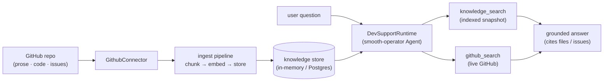

<p align="center">
  
</p>

<h1 align="center">dev-support</h1>

<p align="center">
  <strong>Stand up a dev-team knowledge &amp; support agent over your GitHub repo in minutes.</strong>
</p>

<p align="center">
  Ingest your repo's prose, code, and issues → chat, grounded in the repo,
  with a live <code>github_search</code> for anything newer than the last ingest.
</p>

---

`dev-support` is the smooth-operator showcase: point it at a GitHub repository,
run `ingest`, and you have a support agent that answers questions about the
**codebase**, its **docs**, and its **issue history** — citing the files and
issues it used. It's a real, compiling, tested CLI built on the smooth-operator
ingestion pipeline + agent runtime.

## Quickstart

```sh
# 1. Bring your credentials (secrets stay in the environment, never the config)
export GITHUB_TOKEN=ghp_…          # a GitHub PAT — read scope is enough
export SMOOAI_GATEWAY_KEY=…        # your llm.smoo.ai gateway key

# 2. Point dev-support.toml at YOUR repo
#    [github]
#    owner = "your-org"
#    repo  = "your-repo"
#    auth  = "token"            # or "none" for public repos
$EDITOR dev-support.toml

# 3. Ingest the repo (prose + code + issues) into a knowledge store
cargo run -p smooai-smooth-operator-example-dev-support -- ingest

# 4. Chat — grounded in the repo
cargo run -p smooai-smooth-operator-example-dev-support -- chat
```

> The default `dev-support.toml` points at a small **public** repo with
> `auth = "none"`, so `… -- ingest` runs out of the box with no `GITHUB_TOKEN`.
> Add your key + repo to chat about your own codebase.

### Sample transcript

```text
$ cargo run -p …example-dev-support -- chat
==> Ingesting your-org/your-repo …
==> Indexed 482 chunks from 137 documents. Ask away (Ctrl-D or 'exit' to quit).

you ▸ How does the ingestion pipeline dedupe re-runs?

agent ▸ Re-runs are idempotent on (document id, content hash): an IngestLedger
        records every (org, doc id, chunk-hash) key it stores, and a document
        whose chunks are all already in the ledger is skipped whole. Changed
        content produces a new hash, so it's re-ingested.
        Source: ingestion/src/pipeline.rs (IngestLedger, content_hash).

        (tools used: knowledge_search)

you ▸ Did anything change about retries in the last few merged PRs?

agent ▸ Yes — the RetryPolicy default now retries Cloudflare 5xx (520–527) plus
        504, not just 429/500/502/503. See the live result below.
        Source: smooth-operator-core/src/llm.rs (RetryPolicy::default).

        (tools used: knowledge_search, github_search)
```

The agent reaches for **`knowledge_search`** (the indexed snapshot) first, and
**`github_search`** (live GitHub) when you ask about something that might be
newer than the last ingest.

## How it works



- **Ingest** — `GithubConnector` pulls READMEs/`docs/`/`*.md` (prose), source
  files (code), and issues/PRs. The pipeline chunks, embeds (with the
  network-free `DeterministicEmbedder`), and stores each chunk in a knowledge
  store. Re-runs are idempotent on `(doc id, content hash)`.
- **Chat** — `DevSupportRuntime` wires that knowledge into a real
  smooth-operator `Agent` three ways: (1) the engine **auto-injects** top
  matches as context before the first LLM call, (2) the agent can call
  **`knowledge_search`** to query the index itself, and (3) it can call
  **`github_search`** for the live state of the repo. The model runs against the
  `llm.smoo.ai` gateway.

## Configuration

Everything lives in `dev-support.toml` (see `dev-support.example.toml` for a
fully-annotated reference). Secrets are read from the environment, so the file
is safe to commit:

| What | Where |
| ---- | ----- |
| Repo + auth mode + content tiers | `[github]` in `dev-support.toml` |
| Model + system prompt + enabled tools | `[agent]` in `dev-support.toml` |
| GitHub PAT (when `auth = "token"`) | `$GITHUB_TOKEN` |
| LLM gateway key | `$SMOOAI_GATEWAY_KEY` |
| Gateway URL (optional) | `$SMOOAI_GATEWAY_URL` (default `https://llm.smoo.ai/v1`) |

```toml
[github]
owner = "your-org"
repo  = "your-repo"
auth  = "token"            # "token" → $GITHUB_TOKEN, "none" → public
private = false            # true → ingested docs get a restricting ACL

[github.include]
prose = true               # READMEs, docs/, *.md
code  = true               # source files
issues = true              # issues + PRs

[agent]
model = "claude-haiku-4-5"
system_prompt = "…"        # keeps the agent grounded; sane default shipped
tools = ["knowledge_search", "github_search"]
```

## Smoo-powered or BYO

- **Smoo-powered** — at [lom.smoo.ai](https://lom.smoo.ai), Smoo's first-party
  GitHub App wires repo access for you in one click (per-customer installation —
  no PAT to mint or rotate). The connector supports this via
  `GithubAuth::AppInstallation`.
- **BYO (self-host)** — bring a personal-access token (`auth = "token"` +
  `$GITHUB_TOKEN`) or run public-only (`auth = "none"`). Same code path.

## The full-page chat-widget UI (`serve`)

`ingest` + `chat` is the fastest way to see grounded answers in a terminal. For
the **full chat-widget UI**, `serve` does the whole thing in one command: it
**ingests the configured repo on boot** and then **runs the real
`smooai-smooth-operator-server`** over that knowledge — so the embeddable widget
([`@smooai/chat-widget`](https://github.com/SmooAI/chat-widget)) can connect and
chat, grounded in your repo:

```sh
# Edit dev-support.toml (owner/repo), then:
export SMOOAI_GATEWAY_KEY=…                 # the llm.smoo.ai gateway key (for chat)
cargo run -p smooai-smooth-operator-example-dev-support -- serve
```

`serve` ingests the repo (same connector + pipeline as `ingest`/`chat`), builds
the server's `AppState` over that knowledge, and binds the WebSocket endpoint —
calling the server crate's own serve loop as a library (it does **not**
reimplement the WS protocol). On boot it prints a ready banner like:

```text
✓ dev-support is serving rust-lang/mdBook
  ingested:  214 docs, 1187 chunks (embedding dim 1536)
  storage:   in-memory (this demo; the index is gone on exit)

  WebSocket: ws://127.0.0.1:8787/ws

Point the chat-widget (@smooai/chat-widget) at it — full-page mode:

  <smoo-chat-widget mode="fullpage" endpoint="ws://127.0.0.1:8787/ws"></smoo-chat-widget>

AUTH_MODE=none is the local-dev default (org-public): anonymous widget
connections see the repo's org-public knowledge. Set AUTH_MODE=jwt + a key to gate it.
```

Configuration comes from the same env contract the server uses
(`SMOOAI_GATEWAY_KEY`, `SMOOTH_AGENT_MODEL`, `SMOOTH_AGENT_BIND`,
`SMOOTH_AGENT_PORT`, `SMOOTH_AGENT_STORAGE`). The embedder is selected
automatically: the real semantic `GatewayEmbedder` (1536-d) when
`SMOOAI_GATEWAY_KEY` is set, else the network-free deterministic embedder
(1024-d) — so `serve` even boots offline (with `send_message` returning a clean
`LLM_UNAVAILABLE` error until you add the key). The optional rerank stage is
off by default and opt-in via `SMOOTH_AGENT_RERANK` (`gateway`/`lexical`).

> **Local-dev auth.** `AUTH_MODE=none` (or unset) serves the repo's **org-public**
> knowledge to anonymous widget connections — the local demo default. Set
> `AUTH_MODE=jwt` + a key (or `AUTH_MODE=smoo`) to gate retrieval per principal;
> the server already enforces the per-connection document ACL.

## Persistence

The demo uses an **in-memory** knowledge store (gone on exit) so there's zero
setup. For persistence across restarts, set `SMOOTH_AGENT_STORAGE=postgres` and a
connection string (`SMOOTH_AGENT_DATABASE_URL` / `DATABASE_URL`): `serve` ingests
into the **Postgres (pgvector)** adapter instead — the connector and pipeline
code are identical, only the `StorageAdapter` changes, and the index survives a
restart. (When keyed, `serve` opens the Postgres adapter with the same 1536-d
`GatewayEmbedder` it ingests with, so document and query vectors agree.)

## Tests

```sh
# Offline smoke tests — no network, no real GitHub, no API key.
# - smoke:       ingests a fixture "repo" and runs a grounded chat turn (MockLlmClient).
# - serve_smoke: builds the serve AppState from an ingested fixture, boots the REAL
#                server on an ephemeral port, drives a WS turn, and asserts a grounded
#                reply over the served knowledge.
cargo test -p smooai-smooth-operator-example-dev-support

# Gated live test — one real turn against the llm.smoo.ai gateway.
export SMOOAI_GATEWAY_KEY=…  SMOOTH_AGENT_E2E=1
cargo test -p smooai-smooth-operator-example-dev-support --test live -- --nocapture
```
