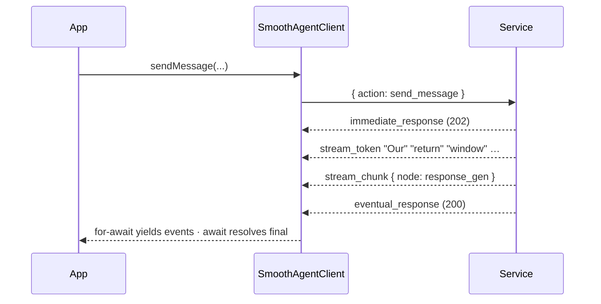
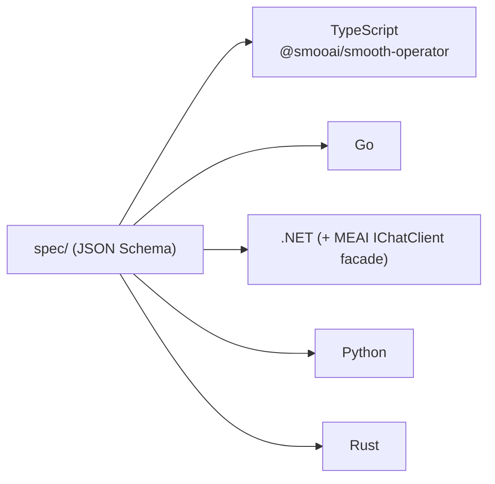
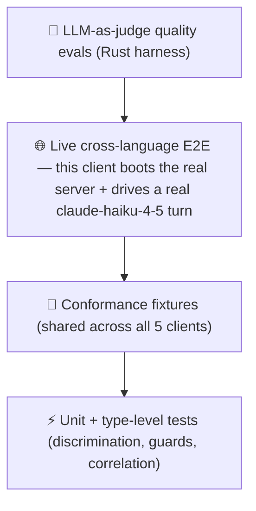

<p align="center"></p>

<p align="center"><strong><code>@smooai/smooth-operator</code></strong> — the Lambda-native TypeScript client for the smooth-operator protocol. Streaming agent turns, HITL resume, fully typed.</p>

<p align="center">
  <a href="../LICENSE"></a>
  
  
  <a href="https://lom.smoo.ai"></a>
</p>

---

## What is this?

The **native TypeScript client** for the [smooth-operator](../docs/PROTOCOL.md) WebSocket protocol — and the one the [smooai monorepo dogfoods](https://github.com/SmooAI/smooth-operator). Types are **generated** from the language-neutral JSON Schemas in [`../spec`](../spec) (and committed, so consumers don't need the generator), with an ergonomic layer — discriminated unions + type guards — on top. It's Lambda-native and transport-injectable, so it runs in a browser, on Node, or inside a Lambda handler unchanged.

---

## 30-second quickstart

```bash
pnpm add @smooai/smooth-operator   # npm publish pending — use a workspace / file: dep today
```

Requires Node ≥ 22, ESM only. Until the package is published, depend on it from a
sibling checkout (`"@smooai/smooth-operator": "workspace:*"` in a pnpm workspace, or
`"file:../smooth-operator/typescript"`).

```ts
import { SmoothAgentClient } from '@smooai/smooth-operator';

const client = new SmoothAgentClient({ url: 'ws://127.0.0.1:8787/ws' });
await client.connect();

const session = await client.createConversationSession({ agentId, userName: 'Alice' });
const turn = client.sendMessage({ sessionId: session.sessionId, message: 'How long is your return window?' });

const final = await turn; // EventualResponse — cost, tokens, messageId
console.log(final.data.payload.messageId);
```

(Point `url` at your own [`smooth-operator-server`](../rust/README.md), or at the hosted endpoint.)

---

## Watch it stream

`sendMessage` returns a `MessageTurn` that is **both** an async-iterable of events **and** awaitable for the authoritative terminal state. Iterate tokens as they arrive; `await` the same handle for the final response.

```ts
const turn = client.sendMessage({ sessionId: session.sessionId, message: 'Where is my order?' });

for await (const ev of turn) {
  if (ev.type === 'stream_chunk') console.error(`  ↳ node: ${ev.node}`);     // workflow node boundary
  if (ev.type === 'stream_token') process.stdout.write(ev.token ?? '');       // tokens, live
  if (ev.type === 'write_confirmation_required') {
    // HITL: a tool wants to write. Approve, and the resumed stream flows back into THIS turn.
    client.confirmToolAction({ sessionId: session.sessionId, requestId: turn.requestId, approved: true });
  }
}

const final = await turn; // EventualResponse — the authoritative terminal state
```



---

## Transport injection

The client never touches a real socket directly — it talks to an injectable `Transport`. The default uses the global `WebSocket`. On Node, inject the `ws` package; in tests, inject a mock — which is how the conformance suite exercises real client code (correlation, parsing, HITL routing) without a network.

```ts
import WebSocket from 'ws';
new SmoothAgentClient({ url, webSocketFactory: (u) => new WebSocket(u) });
```

## Runtime validation (optional, Node-only)

```ts
import { ProtocolValidator } from '@smooai/smooth-operator';
const v = await ProtocolValidator.load();
v.validateEvent(incomingEvent); // { valid, errors } — ajv-compiled from the spec schemas
```

---

## Polyglot — one spec, five clients

This is one of five native clients generated from the same protocol. Need C# / Microsoft.Extensions.AI? The **`IChatClient` facade** lives in the [.NET client](../dotnet/README.md) (it's a .NET-ecosystem feature). This TypeScript package is the native streaming client.



---

## Test-driven by default

> **Nothing here is vibe-coded — it's verified against a real LLM gateway.**



**16 tests** cover the conformance fixtures, the client (with a mock transport so real parsing/correlation/HITL run), and type-level checks. In the **live cross-language E2E**, this client boots a real `smooth-operator-server` subprocess (KB seeded), drives a real `claude-haiku-4-5` turn over WebSocket, and asserts ≥1 streamed event, a knowledge-grounded "17", and per-session memory.

**The proof story:** an LLM-as-judge scored a multi-turn answer **1/5** (the runtime forgot turn 1's context); the failing eval drove a per-session-memory fix; **it now scores 5/5** — a regression a substring test would have missed. See [`docs/EVALS.md`](../docs/EVALS.md).

Live tests are **gated, never silently skipped**: they run with `SMOOTH_AGENT_E2E=1` + `SMOOAI_GATEWAY_KEY` and skip cleanly otherwise.

```bash
pnpm test          # conformance + client + type-level — no creds
pnpm test:e2e      # live cross-language E2E (needs gateway key)
```

## Scripts

| Script | Purpose |
| --- | --- |
| `pnpm generate` | Regenerate `src/generated/types.ts` from `../spec`. |
| `pnpm build` | `tsc` → `dist/`. |
| `pnpm typecheck` | Type-check `src/` + `test/` without emitting. |
| `pnpm test` | Vitest (conformance + client + type-level). |

The generated types are committed; CI runs `pnpm generate` + `git diff --exit-code` to catch schemas that changed without a regenerate.

## Smoo-powered or bring-your-own

Point the client at the hosted **[lom.smoo.ai](https://lom.smoo.ai)** endpoint, or at your own self-hosted `smooth-operator-server` (AWS Lambda or k8s) — same protocol, same client, same code.

## License

MIT © 2026 Smoo AI
